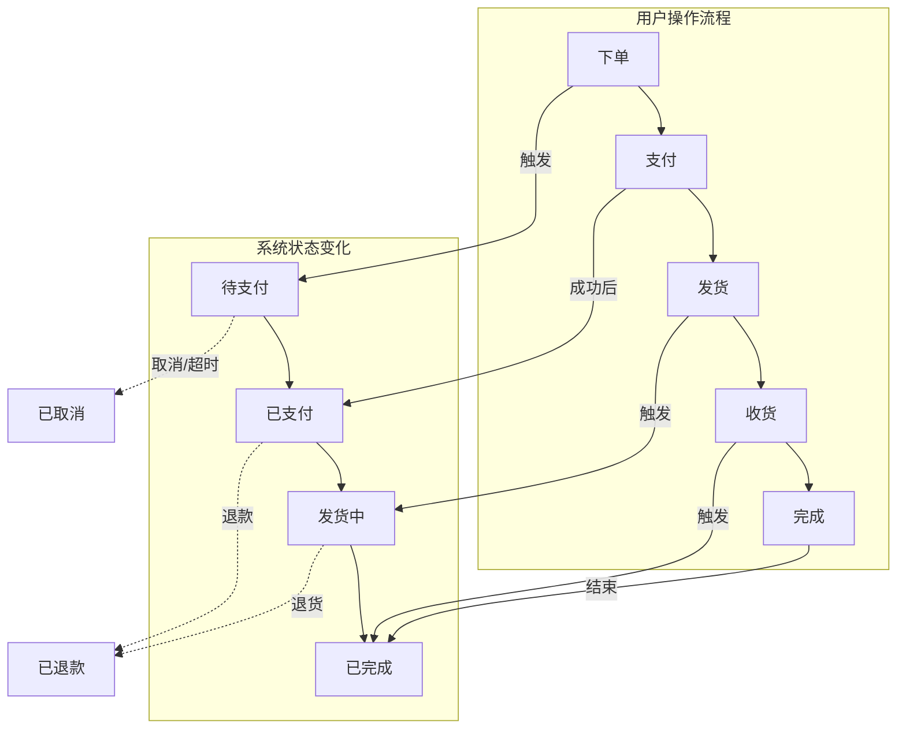

# 图示素材：流程-状态映射图

> 素材类型：图示需求描述
> 知识点：A3-04 流程与状态
> 来源：知识点地图 A3-04 图示需求
> 更新日期：2026-04-19

---

## 图示需求描述

一张展示「流程步骤 ↔ 状态变化」映射关系的图，让产品经理直观理解：

1. 流程的每一步对应一个状态
2. 流程推进就是状态变化
3. 状态机是管理这些状态变化规则的系统

---

## 图示设计建议

### 设计风格

采用「双层映射」设计：
- **上层**：流程图（用户操作步骤）
- **下层**：状态图（系统状态变化）
- **映射线**：用箭头或连接线表示流程步骤与状态的对应关系

### 内容元素

| 元素 | 样式建议 | 说明 |
|------|---------|------|
| 流程步骤 | 矩形、蓝色系 | 用户操作 |
| 状态节点 | 圆角矩形、绿色系 | 系统状态 |
| 映射箭头 | 垂直箭头、实线 | 步骤→状态对应关系 |
| 状态跳转箭头 | 水平箭头、实线 | 状态如何变化 |
| 条件标注 | 小矩形或文字标注 | 状态跳转条件 |

---

## Mermaid 图示草稿（供插画师参考）

---

## 图示说明文字（可用于章节）

> 「这张图展示了流程和状态的关系。
>
> **上面一行**是用户操作——下单、支付、发货、收货。
>
> **下面一行**是系统状态——待支付、已支付、发货中、已完成。
>
> 每一个用户操作，都对应一个状态变化：
> - 下单 → 系统状态变为「待支付」
> - 支付 → 系统状态变为「已支付」
> - 发货 → 系统状态变为「发货中」
> - 收货 → 系统状态变为「已完成」
>
> **流程推进 = 状态变化**。没有状态变化，流程就没推进。」

---

## 图示变体选项

### 变体 1：表格版（流程-状态对应表）

| 用户操作 | 状态变化 | 跳转条件 |
|---------|---------|---------|
| 下单 | → 待支付 | 用户点击下单 |
| 支付 | → 已支付 | 支付成功 |
| 取消 | → 已取消 | 用户取消或超时 |
| 发货 | → 发货中 | 商家发货 |
| 收货 | → 已完成 | 用户确认收货 |
| 退款 | → 已退款 | 用户申请退款 |

### 变体 2：状态机单独展示版

仅展示状态流转图，用于「状态机是什么」的概念讲解。

### 变体 3：流程图叠加状态版

在流程图节点内直接标注状态，更加紧凑。

---

## 图示质量标准

| 标准 | 说明 |
|------|------|
| 映射清晰度 | 流程步骤与状态对应关系一目了然 |
| 异常覆盖 | 至少展示 2 种异常状态（取消、退款） |
| 一致性 | 与术语表定义一致 |
| 可理解性 | 产品经理能在 10 秒内理解「流程推进=状态变化」 |

---

## 素材质量自评

| 维度 | 评分 | 说明 |
|------|------|------|
| 需求清晰度 | ⭐⭐⭐⭐⭐ | 图示用途、元素、样式都有明确说明 |
| Mermaid 草稿 | ⭐⭐⭐⭐⭐ | 提供可直接使用的代码草稿 |
| 变体选项 | ⭐⭐⭐⭐⭐ | 提供表格版、状态机版等多种变体 |
| 说明文字 | ⭐⭐⭐⭐⭐ | 提供可直接引用的图示说明 |