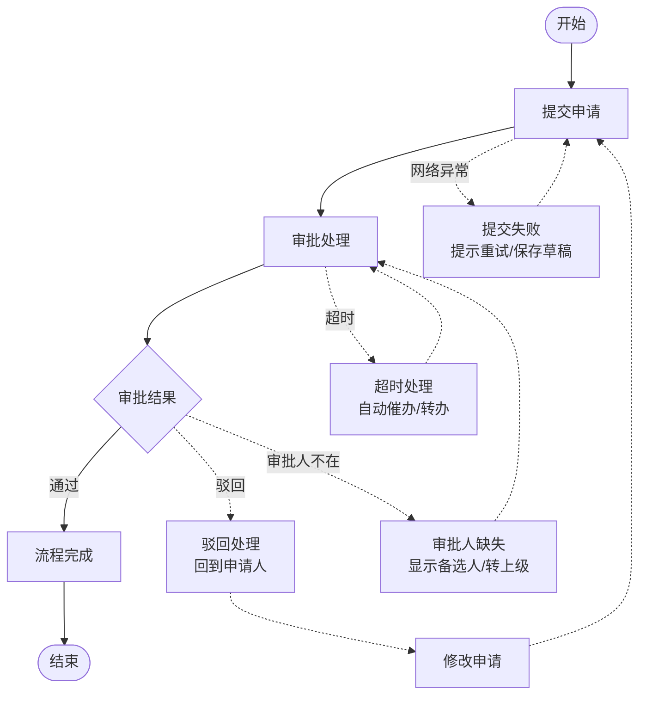

# 图示素材：含异常路径的流程图

> 素材类型：图示需求描述
> 知识点：A3-03 异常流程
> 来源：知识点地图 A3-03 图示需求
> 更新日期：2026-04-19

---

## 图示需求描述

一张展示「正常流程 + 异常流程」对比的流程图，让产品经理直观理解：

1. 正常流程是主干道
2. 异常流程是分支（备用路线）
3. 每个流程节点都可能产生异常分支

---

## 图示设计建议

### 设计风格

- **主干道**：用实线、深色表示正常流程
- **异常分支**：用虚线、浅色或不同颜色表示异常流程
- **分支起点**：在正常流程节点处标注「异常触发点」
- **分支终点**：标注「异常处理结果」

### 内容元素

| 元素 | 样式建议 | 说明 |
|------|---------|------|
| 正常流程节点 | 矩形、深色 | 主流程步骤 |
| 异常流程节点 | 矩形、浅色/虚线边框 | 异常处理步骤 |
| 正常流程箭头 | 实线箭头 | 主流程走向 |
| 异常流程箭头 | 虚线箭头 | 异常流程走向 |
| 异常触发点标注 | 圆角矩形、标注文字 | 「驳回」「超时」「取消」等 |
| 流程起点 | 圆形、实心 | 流程开始 |
| 流程终点 | 圆形、空心或双圆 | 流程结束 |

---

## Mermaid 图示草稿（供插画师参考）

---

## 图示说明文字（可用于章节）

> 「这张流程图展示了一个审批流程的完整设计。
>
> **实线部分**是正常流程——从提交到审批到完成。
>
> **虚线部分**是异常流程——网络异常、超时、驳回、审批人缺失等场景的处理路径。
>
> 每一个『卡住』的节点，都有对应的异常分支。这就是异常流设计——让用户在主干道堵住时，有备用路线可走。」

---

## 图示变体选项

### 变体 1：简化版（仅展示驳回和超时）

适用于入门讲解，只展示最常见的两种异常。

### 变体 2：详细版（展示所有异常类型）

适用于深度讲解，展示更多异常场景。

### 变体 3：对比版（正常流程 vs 含异常流程）

左右对比：
- 左侧：只有正常流程的图（用户会「卡住」）
- 右侧：含异常流程的图（用户有「备用路线」）

---

## 图示质量标准

| 标准 | 说明 |
|------|------|
| 清晰度 | 正常流程和异常流程能一眼区分 |
| 完整性 | 至少展示 3 种异常场景 |
| 一致性 | 与术语表定义一致 |
| 可理解性 | 产品经理能在 10 秒内理解图意 |

---

## 素材质量自评

| 维度 | 评分 | 说明 |
|------|------|------|
| 需求清晰度 | ⭐⭐⭐⭐⭐ | 图示用途、元素、样式都有明确说明 |
| Mermaid 草稿 | ⭐⭐⭐⭐⭐ | 提供可直接使用的代码草稿 |
| 变体选项 | ⭐⭐⭐⭐⭐ | 提供多种版本适应不同讲解深度 |
| 说明文字 | ⭐⭐⭐⭐⭐ | 提供可直接引用的图示说明 |