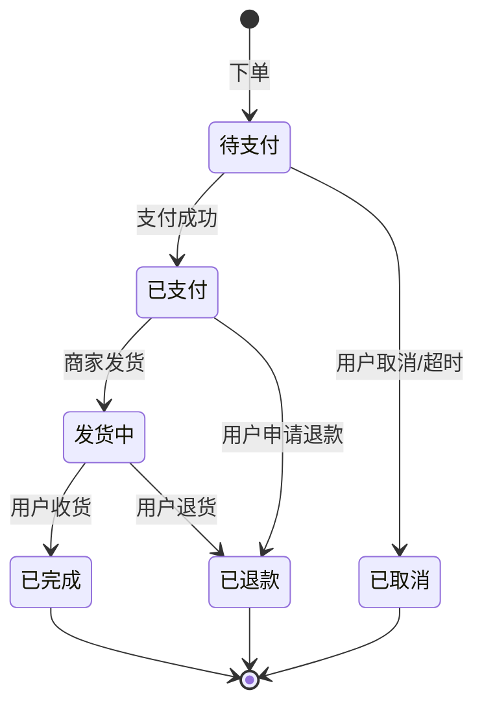

# 故事素材：老李解释状态机和流程的关系

> 素材类型：故事场景
> 知识点：A3-04 流程与状态
> 来源：知识点地图 A3-04 故事锚点
> 更新日期：2026-04-19

---

## 核心故事框架

### 场景设定

需求评审会上，**小想**刚说完订单流程的设计：

> 「用户下单 → 支付 → 发货 → 收货 → 完成，就这几步。」

开发组长听完，直接说：

> 「你这个流程需要**状态机**，不然做不了。」

**小想**一脸茫然：「状态机？那是...什么？咖啡机吗？」

**老李**（40+ 岁产品总监）笑了笑，接话：

> 「不是咖啡机。状态机是控制流程怎么『走』的规则系统。」

---

## 老李的解释（核心段落）

### 什么是状态机

> 「**状态**，就是系统在某一时刻的数据情况。比如订单现在是『待支付』，过一会变成『已支付』。
>
> **状态机**，就是定义『状态怎么变』的规则。它规定了：
> - 有哪些状态（待支付、已支付、发货中、已完成...）
> - 状态怎么跳（待支付 → 已支付，可以；待支付 → 已完成，不行）
> - 跳转条件是什么（支付成功才能从待支付跳到已支付）
>
> 状态机就像**轨道切换器**——控制列车（流程）走哪条轨道。」

### 流程和状态的关系

小想追问：「那流程和状态有什么区别？」

老李画了一张图：

> 「**流程图**描述的是『操作步骤』——用户做了什么动作。
> **状态**描述的是『当前情况』——系统现在处于什么状态。
>
> 流程的每一步，对应一个状态变化：
>
> | 用户操作 | 状态变化 |
> |---------|---------|
> | 下单 | → 待支付 |
> | 支付成功 | → 已支付 |
> | 商家发货 | → 发货中 |
> | 用户收货 | → 已完成 |
>
> **流程推进 = 状态变化**。没有状态变化，流程就没推进。」

### 为什么开发说「要状态机」

> 「开发说『要状态机』，意思是：你流程图画了，但没告诉系统**怎么跳**。
>
> 比如：支付失败，订单状态怎么变？用户取消订单，状态怎么变？超时未支付，状态怎么变？
>
> 这些**跳转规则**，开发需要知道才能写代码。你只画了『正常流程』，没画『跳转规则』，开发就问：『状态机呢？』」

---

## 状态机核心要素

| 要素 | 说明 | 产品经理视角 |
|------|------|-------------|
| **状态定义** | 有哪些状态 | 「订单可以是这几种情况」 |
| **初始状态** | 流程开始时的状态 | 「下单后是待支付」 |
| **终态** | 流程结束时的状态 | 「已完成、已取消」 |
| **跳转规则** | 状态怎么变、条件是什么 | 「支付成功 → 待支付变已支付」 |
| **禁止跳转** | 哪些跳转不允许 | 「待支付不能直接跳到已完成」 |

---

## 状态机示例（订单）

---

## 产品经理常见的误解

### 误解 1：流程图 = 状态机

老李摇头：

> 「**流程图 ≠ 状态机**。
>
> 流程图说的是『用户做了什么』，状态机说的是『系统怎么响应』。
>
> 你画流程图：下单 → 支付 → 发货 → 收货。但系统要知道：支付失败怎么办？超时怎么办？取消后怎么办？
>
> 这些是**状态跳转规则**，流程图没画，状态机要画。」

### 误解 2：状态自然就对了

小想：「那状态不就是跟着流程走吗，还需要特别设计？」

老李：

> 「这就是问题。你以为状态『自然就对了』，但系统不知道：
> - 待支付能不能跳到已完成？不能，因为没支付。
> - 发货中能不能跳回已支付？不能，因为货已发了。
> - 已取消的订单能不能再变成已支付？通常不能。
>
> 这些『能跳』『不能跳』，你要明确告诉系统。这就是状态机做的事。」

---

## 可引用的关键句

> 「状态机就像轨道切换器——控制流程怎么走。」

> 「流程推进 = 状态变化。没有状态变化，流程就没推进。」

> 「流程图说的是『用户做了什么』，状态机说的是『系统怎么响应』。」

> 「开发说『要状态机』，意思是：你流程图画了，但没告诉系统『怎么跳』。」

---

## 类比建议

### 交通类比（主类比）

> 「状态机就像**红绿灯**。
>
> 红灯 → 黄灯 → 绿灯，按顺序切换。不能从红灯直接跳到绿灯，必须先过黄灯。
>
> 状态机也是这样：待支付 → 已支付 → 发货中 → 已完成。有些跳可以，有些跳不行。规则写在状态机里。」

### 游戏类比

> 「状态机就像角色的『形态切换』。
>
> 正常状态 → 受伤状态 → 死亡状态。每种形态有不同规则：受伤状态不能攻击，死亡状态不能移动。
>
> 状态不能随便跳——你不能从『正常』直接跳到『死亡』，必须先经过『受伤』。」

---

## 素材质量自评

| 维度 | 评分 | 说明 |
|------|------|------|
| 场景真实度 | ⭐⭐⭐⭐⭐ | 「开发说要状态机」是真实高频场景 |
| 概念解释清晰度 | ⭐⭐⭐⭐⭐ | 流程 vs 状态 vs 状态机三层解释 |
| 老李人设契合 | ⭐⭐⭐⭐⭐ | 老李用类比解释技术概念，符合角色 |
| 误解针对性 | ⭐⭐⭐⭐⭐ | 「流程图=状态机」是 PM 典型误解 |