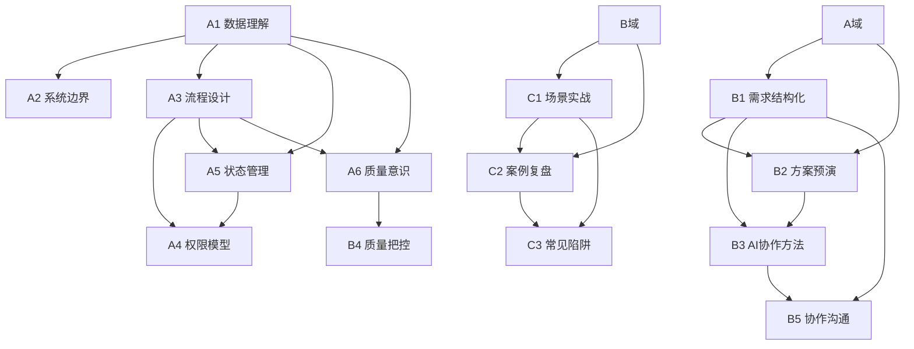

# 知识点地图

> 产品经理的小册子 - 知识体系与写作规划
> 版本：V1.0
> 更新日期：2026-04-18

---

## 一、地图设计目的

本知识点地图服务于以下目标：

1. **写作参考**：创作章节时，快速定位知识点、场景锚点、叙事线索
2. **批量规划**：规划并发写作任务，识别独立可并行的章节
3. **读者路径**：定义读者的学习路径和能力演进顺序
4. **质量验收**：每个知识点对应明确的验收标准

---

## 二、知识域总览

全书知识体系分为 **三大域、六大模块**：

```
┌─────────────────────────────────────────────────────────────────────┐
│                        知识点地图总览                                 │
├─────────────────────────────────────────────────────────────────────┤
│                                                                     │
│  ┌─────────────────┐     ┌─────────────────┐     ┌─────────────┐   │
│  │   认知域         │     │   方法域         │     │   实践域     │   │
│  │ Domain A        │     │ Domain B        │     │ Domain C    │   │
│  ├─────────────────┤     ├─────────────────┤     ├─────────────┤   │
│  │ • 数据理解       │     │ • 需求结构化     │     │ • 场景实战  │   │
│  │ • 系统边界       │     │ • 方案预演       │     │ • 案例复盘  │   │
│  │ • 流程设计       │     │ • AI协作方法     │     │ • 常见陷阱  │   │
│  │ • 权限模型       │     │ • 质量把控       │     │ • 工具推荐  │   │
│  │ • 状态管理       │     │ • 协作沟通       │     │             │   │
│  │ • 质量意识       │     │                 │     │             │   │
│  └─────────────────┘     └─────────────────┘     └─────────────┘   │
│                                                                     │
│  学习顺序: A → B → C（认知打底 → 方法赋能 → 实践巩固）               │
│                                                                     │
└─────────────────────────────────────────────────────────────────────┘
```

---

## 三、认知域（Domain A）详细知识点

> 认知域是全书基础，解决"听不懂"痛点。读者完成此域学习后，能理解开发说的技术方案。

### 模块 A1：数据理解

| KP编号 | 知识点 | 核心概念 | 典型场景 | 故事锚点 | 前置依赖 |
|--------|--------|----------|----------|----------|----------|
| A1-01 | 数据是什么 | 数据是信息的载体，有类型、格式、约束 | 业务提需求说"存一个字段"，开发问"什么类型？" | 老李："我让业务说清楚字段类型，开发才肯开工" | 无 |
| A1-02 | 数据结构 | 数据的组织方式：字段、表、关系 | PRD写"用户信息"，开发问"有哪些字段？必填吗？" | 小想用AI生成字段表，漏了"手机号格式校验" | A1-01 |
| A1-03 | 数据流转 | 数据从输入到输出的路径 | 业务问"数据怎么从A到B"，开发说"要经过三个系统" | 老李画数据流图，发现漏了"异常数据怎么处理" | A1-01, A1-02 |
| A1-04 | 数据约束 | 数据的规则限制：格式、范围、唯一性 | 上线后发现"重复数据"，开发说"你没说不能重复" | 小想PRD没写唯一性约束，导致脏数据 | A1-02 |
| A1-05 | 数据存储 | 数据库的基本概念：表、索引、查询 | 开发说"这个查询会慢"，产品问"为什么？" | 老李："数据量大时，查询要考虑索引" | A1-01, A1-02 |

**模块验收标准**：
- [ ] 能识别需求中的数据字段和类型
- [ ] 能描述数据从输入到输出的流转路径
- [ ] 能发现数据约束遗漏并补齐

---

### 模块 A2：系统边界

| KP编号 | 知识点 | 核心概念 | 典型场景 | 故事锚点 | 前置依赖 |
|--------|--------|----------|----------|----------|----------|
| A2-01 | 接口是什么 | 系统间交互的约定：输入、输出、规则 | 开发说"调接口"，产品问"什么接口？" | 老李："接口就像餐厅窗口，你点菜，它给你饭" | A1-01 |
| A2-02 | 接口参数 | 接口的输入输出定义 | 开发问"接口传什么参数？"，产品说"就传用户ID" | 小想漏了"分页参数"，导致数据拉不全 | A2-01 |
| A2-03 | 系统依赖 | 一个系统依赖其他系统的方式 | 开发说"这个功能要等XX系统上线才能做" | 老李发现排期漏了"依赖系统上线时间" | A2-01, A2-02 |
| A2-04 | 集成方式 | 系统间连接的技术手段：API、消息、文件 | 开发说"要用消息队列"，产品问"为什么不直接调接口？" | 老李解释："有些场景不能用同步调用" | A2-01, A2-03 |
| A2-05 | 边界条件 | 系统运行的限制范围 | 上线后系统崩溃，开发说"超出边界了" | 小想没考虑"并发上限"，系统压垮了 | A2-01 |

**模块验收标准**：
- [ ] 能理解开发说的"接口"是什么意思
- [ ] 能识别需求涉及的系统依赖关系
- [ ] 能发现边界条件遗漏并追问

---

### 模块 A3：流程设计

| KP编号 | 知识点 | 核心概念 | 典型场景 | 故事锚点 | 前置依赖 |
|--------|--------|----------|----------|----------|----------|
| A3-01 | 业务流程 | 用户完成目标的操作序列 | 业务说"用户提交审批"，开发问"审批有几步？" | 老李画审批流程，发现漏了"驳回后怎么处理" | 无 |
| A3-02 | 系统流程 | 系统处理请求的内部逻辑 | 开发说"后台要做XX流程"，产品问"为什么这么多步骤？" | 小想："我以为提交就完了，原来后台还有5步" | A3-01, A1-03 |
| A3-03 | 异常流程 | 非正常情况的处理路径 | 上线后用户投诉"流程卡住了"，发现漏了异常处理 | 老李："流程设计最容易漏的是异常流" | A3-01, A3-02 |
| A3-04 | 流程与状态 | 流程推进依赖状态变化 | 开发说"要状态机"，产品问"什么意思？" | 老李解释状态机和流程的关系 | A3-01, A4-01 |
| A3-05 | 流程编排 | 多流程协同的设计 | 业务说"两个流程要并行"，开发问"怎么协调？" | 小想设计并行流程，忘了"冲突怎么处理" | A3-01, A3-02 |

**模块验收标准**：
- [ ] 能画出完整的业务流程图（含异常流）
- [ ] 能区分业务流程和系统流程
- [ ] 能识别流程设计中的遗漏点

---

### 模块 A4：权限模型

| KP编号 | 知识点 | 核心概念 | 典型场景 | 故事锚点 | 前置依赖 |
|--------|--------|----------|----------|----------|----------|
| A4-01 | 权限是什么 | 用户能做什么、不能做什么的控制 | 业务说"所有人都能看"，开发问"包括离职员工？" | 老李："权限就是谁能干什么" | 无 |
| A4-02 | 角色权限 | 按角色分配权限的方式 | 开发问"有哪些角色？每个角色能干什么？" | 小想漏了"临时角色"，导致权限混乱 | A4-01 |
| A4-03 | 数据权限 | 不同角色能看的数据范围 | 业务说"经理看全部"，开发问"跨部门的数据能看吗？" | 老李发现数据权限设计漏了"组织边界" | A4-01, A4-02 |
| A4-04 | 操作权限 | 不同角色能执行的操作 | PRD写"经理可以审批"，开发问"能驳回吗？能撤回吗？" | 小想写权限，漏了"批量操作权限" | A4-01, A4-02 |
| A4-05 | 权限继承 | 权限传递和覆盖的规则 | 业务说"上级自动有下级权限"，开发问"全部继承还是部分？" | 老李追问权限继承边界 | A4-02 |

**模块验收标准**：
- [ ] 能识别需求中的权限要素（角色、数据、操作）
- [ ] 能设计基本的权限矩阵
- [ ] 能发现权限设计遗漏并追问

---

### 模块 A5：状态管理

| KP编号 | 知识点 | 核心概念 | 典型场景 | 故事锚点 | 前置依赖 |
|--------|--------|----------|----------|----------|----------|
| A5-01 | 状态是什么 | 系统在某一时刻的数据情况 | 开发说"订单状态变了"，产品问"有哪些状态？" | 老李："状态就像电表读数，反映当前情况" | 无 |
| A5-02 | 状态流转 | 状态变化的规则和路径 | PRD写"订单完成"，开发问"从哪个状态跳到完成？" | 小想画状态图，漏了"取消状态" | A5-01 |
| A5-03 | 状态约束 | 状态跳转的限制条件 | 开发说"这个状态不能直接跳到那个状态" | 老李追问："什么情况下能跳？什么不能？" | A5-01, A5-02 |
| A5-04 | 状态冲突 | 多操作同时影响状态的场景 | 上线后发现"状态乱了"，开发说"并发问题" | 小想没考虑"两个人同时操作订单" | A5-02, A5-03 |
| A5-05 | 状态机 | 状态流转的规则系统 | 开发说"要设计状态机"，产品问"怎么设计？" | 老李教小想设计状态机 | A5-01, A5-02, A5-03 |

**模块验收标准**：
- [ ] 能识别需求中的状态要素
- [ ] 能画出状态流转图
- [ ] 能识别状态约束和并发风险

---

### 模块 A6：质量意识

| KP编号 | 知识点 | 核心概念 | 典型场景 | 故事锚点 | 前置依赖 |
|--------|--------|----------|----------|----------|----------|
| A6-01 | 验收标准 | 确认需求完成的具体条件 | 开发说"做完了"，产品问"怎么验证？" | 老李："验收标准就是签收快递的检查清单" | 无 |
| A6-02 | 测试场景 | 验证功能的各种情况 | 开发问"要测哪些场景？"，产品说"正常流程就行" | 小想漏了异常场景，上线后出bug | A6-01 |
| A6-03 | 边界测试 | 极端情况的验证 | 上线后发现"大量数据时系统崩溃" | 老李："测试要覆盖边界情况" | A6-01, A6-02 |
| A6-04 | 回归测试 | 修改后重新验证原有功能 | 上线新功能后旧功能出问题，开发说"没测" | 小想不懂回归测试，以为改了就行 | A6-01, A6-02 |
| A6-05 | 监控与告警 | 持续观察系统状态 | 上线后出问题才发现，开发说"没有监控" | 老李强调监控的重要性 | A6-01 |

**模块验收标准**：
- [ ] 能为需求定义验收标准
- [ ] 能识别测试场景遗漏
- [ ] 能理解监控的重要性

---

## 四、方法域（Domain B）详细知识点

> 方法域解决"被拒绝无措"和"无法把控"痛点。读者完成此域学习后，能判断方案可行性、把控质量风险。

### 模块 B1：需求结构化

| KP编号 | 知识点 | 核心概念 | 典型场景 | 故事锚点 | 前置依赖 |
|--------|--------|----------|----------|----------|----------|
| B1-01 | 需求拆解 | 把模糊需求拆成结构化元素 | 业务说"做个审批功能"，产品问"审批什么？谁来审？几步？" | 小想用AI拆需求，发现漏了"审批规则" | A域全部 |
| B1-02 | 需求元素 | 需求的标准组成：数据、流程、权限、状态 | 开发说"需求不完整"，产品问"缺什么？" | 老李教小想需求元素框架 | B1-01 |
| B1-03 | 需求模板 | 结构化需求的标准化格式 | 开发说"需求看不懂"，产品改用模板后顺畅 | 小想套模板写需求，开发点赞 | B1-01, B1-02 |
| B1-04 | 需求完整性检查 | 检查需求是否遗漏的方法 | 需求评审时开发指出遗漏，产品复盘改进 | 老李分享完整性检查清单 | B1-02 |

**模块验收标准**：
- [ ] 能把模糊需求拆成结构化元素
- [ ] 能用模板写出开发看得懂的需求
- [ ] 能自查需求完整性

---

### 模块 B2：方案预演

| KP编号 | 知识点 | 核心概念 | 典型场景 | 故事锚点 | 前置依赖 |
|--------|--------|----------|----------|----------|----------|
| B2-01 | 方案预演概念 | 在开发实现前先模拟方案效果 | 开发说"这个方案有问题"，产品问"怎么提前发现？" | 老李："方案预演就是先做样板间" | B1域 |
| B2-02 | AI辅助预演 | 用AI模拟技术实现 | 小想用AI预演方案，发现状态流转有漏洞 | 老李肯定AI预演的价值 | B2-01 |
| B2-03 | 边界检查 | 用预演发现边界问题 | AI预演后发现"并发时状态冲突" | 小想补上边界场景 | B2-01, B2-02 |
| B2-04 | 方案对比 | 预演多个方案选最优 | 两个方案都能实现，用预演对比优劣 | 老李教小想方案对比方法 | B2-01, B2-02 |

**模块验收标准**：
- [ ] 能用AI辅助预演技术方案
- [ ] 能通过预演发现边界问题
- [ ] 能对比多个方案优劣

---

### 模块 B3：AI协作方法

| KP编号 | 知识点 | 核心概念 | 典型场景 | 故事锚点 | 前置依赖 |
|--------|--------|----------|----------|----------|----------|
| B3-01 | AI能做什么 | AI在产品工作中的能力边界 | 小想让AI写完整需求，AI输出不完整 | 老李："AI是助手，不是替手" | B1域, B2域 |
| B3-02 | 提示词设计 | 给AI清晰指令的方法 | AI输出不理想，小想问"怎么写提示词？" | 老李教小想提示词框架 | B3-01 |
| B3-03 | AI辅助原型 | 用AI快速生成原型 | 小想用AI生成原型，节省大量时间 | 小想分享AI原型技巧 | B3-01, B3-02 |
| B3-04 | AI辅助测试用例 | 用AI生成测试场景 | 测试遗漏场景，小想用AI补齐 | 小想用AI生成测试用例 | B3-01, B3-02 |
| B3-05 | AI输出验证 | 判断AI输出是否可靠的方法 | AI输出有错误，小想没发现 | 老李强调要验证AI输出 | B3-01 |

**模块验收标准**：
- [ ] 能合理界定AI的能力边界
- [ ] 能设计有效的提示词
- [ ] 能验证AI输出可靠性

---

### 模块 B4：质量把控

| KP编号 | 知识点 | 核心概念 | 典型场景 | 故事锚点 | 前置依赖 |
|--------|--------|----------|----------|----------|----------|
| B4-01 | 质量风险识别 | 识别上线可能出问题的地方 | 老李问"上线最怕出什么问题？"小想列举风险 | 老李分享风险识别方法 | A6域 |
| B4-02 | 验收清单设计 | 设计系统化的验收检查项 | 上线后遗漏验收，导致问题 | 小想设计验收清单 | B4-01, A6-01 |
| B4-03 | 测试协同 | 与测试团队有效协作 | 测试说"测不透"，产品问"怎么帮？" | 老李教测试协同方法 | B4-01, A6域 |
| B4-04 | 发布把控 | 上线前的检查和准备 | 上线匆忙出问题，复盘改进 | 小想学习发布把控流程 | B4-01, B4-02 |
| B4-05 | 问题追溯 | 出问题后分析根因的方法 | 上线出bug，复盘找原因 | 老李分享问题追溯方法 | B4-01 |

**模块验收标准**：
- [ ] 能识别质量风险点
- [ ] 能设计验收清单
- [ ] 能追溯问题根因

---

### 模块 B5：协作沟通

| KP编号 | 知识点 | 核心概念 | 典型场景 | 故事锚点 | 前置依赖 |
|--------|--------|----------|----------|----------|----------|
| B5-01 | 开发语言翻译 | 把业务语言翻译成开发能理解的 | 业务说"要快"，开发说"要时间"，产品翻译 | 老李翻译业务需求给开发 | 全域 |
| B5-02 | 技术方案讨论 | 与开发讨论技术方案的技巧 | 开发说方案，产品插不上话 | 老李教小想技术讨论技巧 | B5-01 |
| B5-03 | 异议处理 | 开发说"做不了"时如何应对 | 开发拒绝需求，产品不知道真假 | 老李分享异议处理方法 | B5-01, B5-02 |
| B5-04 | 排期协商 | 协商合理的开发时间 | 开发说"做不了那么快"，产品问"多久能做？" | 小想学习排期协商 | B5-01 |
| B5-05 | 评审准备 | 需求评审前的准备工作 | 评审时被开发问倒，产品复盘改进 | 小想准备评审，顺利通过 | B5-01, B5-02 |

**模块验收标准**：
- [ ] 能把业务语言翻译给开发
- [ ] 能参与技术方案讨论
- [ ] 能应对开发异议

---

## 五、实践域（Domain C）详细知识点

> 实践域综合运用认知和方法，解决实际问题。读者完成此域学习后，能独立应对常见场景。

### 模块 C1：场景实战

| KP编号 | 知识点 | 核心概念 | 典型场景 | 故事锚点 | 前置依赖 |
|--------|--------|----------|----------|----------|----------|
| C1-01 | 审批流程实战 | 完整设计一个审批功能 | 业务提审批需求，产品从零设计 | 老李带小想完整实战审批流程 | A+B域 |
| C1-02 | 权限系统实战 | 完整设计一个权限模型 | 业务提权限需求，产品设计权限矩阵 | 小想独立设计权限系统 | A4域, B域 |
| C1-03 | 数据报表实战 | 完整设计一个数据查询功能 | 业务提报表需求，产品设计数据方案 | 小想设计报表，漏了数据权限 | A1域, A4域, B域 |
| C1-04 | 状态流转实战 | 完整设计一个状态机 | 业务提订单需求，产品设计订单状态 | 小想设计订单状态机 | A5域, B域 |
| C1-05 | 多系统集成实战 | 设计跨系统的功能 | 业务提跨系统需求，产品设计方案 | 老李带小想设计多系统集成 | A2域, B域 |

**模块验收标准**：
- [ ] 能独立完成常见场景的完整设计
- [ ] 能发现设计遗漏并补齐

---

### 模块 C2：案例复盘

| KP编号 | 知识点 | 核心概念 | 典型场景 | 故事锚点 | 前置依赖 |
|--------|--------|----------|----------|----------|----------|
| C2-01 | 遗漏复盘 | 分析需求遗漏的根因 | 需求上线后遗漏，复盘改进 | 老李复盘小想的遗漏案例 | C1域 |
| C2-02 | 翻车复盘 | 分析上线问题的根因 | 上线后出严重问题，复盘改进 | 老李复盘翻车案例 | C1域 |
| C2-03 | 成功复盘 | 分析成功案例的关键要素 | 项目成功，复盘提炼方法 | 小想复盘成功案例 | C1域 |

---

### 模块 C3：常见陷阱

| KP编号 | 知识点 | 核心概念 | 典型场景 | 故事锚点 | 前置依赖 |
|--------|--------|----------|----------|----------|----------|
| C3-01 | 状态陷阱 | 状态设计常见的坑 | 状态设计漏了取消、回退等 | 小想踩状态陷阱，老李指点 | A5域 |
| C3-02 | 权限陷阱 | 权限设计常见的坑 | 权限设计漏了数据权限、临时角色 | 小想踩权限陷阱 | A4域 |
| C3-03 | 异常陷阱 | 异常流程常见的坑 | 只考虑正常流程，漏了异常处理 | 小想踩异常陷阱 | A3域, A6域 |
| C3-04 | 边界陷阱 | 边界条件常见的坑 | 没考虑并发、大数据量等边界 | 小想踩边界陷阱 | A2域, A6域 |
| C3-05 | AI陷阱 | AI辅助常见的坑 | 过度依赖AI、不验证AI输出 | 小想踩AI陷阱 | B3域 |

---

## 六、知识点依赖图



---

## 七、批量写作计划

### 并行度分析

基于知识点依赖关系，写作任务可按以下并行度组织：

| 批次 | 可并行知识点 | 并行度 | 说明 |
|------|-------------|--------|------|
| **Batch 1** | A1-01, A3-01, A4-01, A5-01, A6-01 | 5 | 认知域入门点，无依赖，可全并行 |
| **Batch 2** | A1-02, A1-03, A2-01, A3-02, A5-02 | 5 | Batch 1 后续，可并行 |
| **Batch 3** | A1-04, A1-05, A2-02, A2-03, A3-03, A4-02, A5-03 | 7 | 中层知识点，可并行 |
| **Batch 4** | A2-04, A2-05, A3-04, A3-05, A4-03, A4-04, A4-05, A5-04, A5-05, A6-02, A6-03, A6-04, A6-05 | 13 | 高层知识点，可并行 |
| **Batch 5** | B1-01, B2-01, B3-01, B4-01, B5-01 | 5 | 方法域入门点，认知域完成后可并行 |
| **Batch 6** | B1-02, B1-03, B1-04, B2-02, B2-03, B3-02, B4-02, B4-03, B5-02, B5-03, B5-04 | 11 | 方法域中层，可并行 |
| **Batch 7** | B2-04, B3-03, B3-04, B3-05, B4-04, B4-05, B5-05 | 7 | 方法域高层，可并行 |
| **Batch 8** | C1-01, C1-02, C1-03, C1-04, C1-05 | 5 | 场景实战，方法域完成后可并行 |
| **Batch 9** | C2-01, C2-02, C2-03, C3-01, C3-02, C3-03, C3-04, C3-05 | 8 | 复盘和陷阱，可并行 |

### 建议写作顺序

**第一阶段：认知域基础**（Batch 1-4）
- 目标：建立最小必要软件工程认知
- 时间：预计 4-5 周完成
- 并行度：每批最多 13 个章节可同时写作

**第二阶段：方法域进阶**（Batch 5-7）
- 目标：建立需求结构化、AI协作、质量把控能力
- 时间：预计 3-4 周完成
- 前置条件：认知域 Batch 1-4 完成

**第三阶段：实践域综合**（Batch 8-9）
- 目标：场景实战、案例复盘、常见陷阱
- 时间：预计 2-3 周完成
- 前置条件：方法域完成

---

## 八、章节映射建议

### 章节编号规则

- 认知域章节：`ch-01` ~ `ch-12`（每个模块可分 2 章）
- 方法域章节：`ch-13` ~ `ch-20`
- 实践域章节：`ch-21` ~ `ch-28`

### 详细章节规划（待后续 Issue 确认）

| 章节 | 知识点覆盖 | 预估篇幅 | 状态 |
|------|-----------|----------|------|
| ch-01 | A1-01, A1-02（数据基础） | 3000-5000字 | planned |
| ch-02 | A1-03, A1-04, A1-05（数据流转与约束） | 3000-5000字 | planned |
| ch-03 | A2-01, A2-02（接口基础） | 3000-5000字 | planned |
| ch-04 | A2-03, A2-04, A2-05（系统集成与边界） | 3000-5000字 | planned |
| ch-05 | A3-01, A3-02（流程基础） | 3000-5000字 | planned |
| ch-06 | A3-03, A3-04, A3-05（异常流程与编排） | 3000-5000字 | planned |
| ch-07 | A4-01, A4-02（权限基础） | 3000-5000字 | planned |
| ch-08 | A4-03, A4-04, A4-05（数据权限与继承） | 3000-5000字 | planned |
| ch-09 | A5-01, A5-02（状态基础） | 3000-5000字 | planned |
| ch-10 | A5-03, A5-04, A5-05（状态约束与状态机） | 3000-5000字 | planned |
| ch-11 | A6-01, A6-02（验收与测试基础） | 3000-5000字 | planned |
| ch-12 | A6-03, A6-04, A6-05（边界测试与监控） | 3000-5000字 | planned |
| ch-13 | B1-01, B1-02, B1-03, B1-04（需求结构化） | 4000-6000字 | planned |
| ch-14 | B2-01, B2-02, B2-03, B2-04（方案预演） | 4000-6000字 | planned |
| ch-15 | B3-01, B3-02（AI能力边界） | 3000-5000字 | planned |
| ch-16 | B3-03, B3-04, B3-05（AI辅助实践） | 3000-5000字 | planned |
| ch-17 | B4-01, B4-02, B4-03, B4-04, B4-05（质量把控） | 4000-6000字 | planned |
| ch-18 | B5-01, B5-02, B5-03（协作沟通基础） | 3000-5000字 | planned |
| ch-19 | B5-04, B5-05（排期与评审） | 3000-5000字 | planned |
| ch-20 | 综合案例：从需求到交付 | 5000-8000字 | planned |
| ch-21 | C1-01, C1-02（审批与权限实战） | 4000-6000字 | planned |
| ch-22 | C1-03, C1-04（报表与状态实战） | 4000-6000字 | planned |
| ch-23 | C1-05（多系统集成实战） | 3000-5000字 | planned |
| ch-24 | C2-01, C2-02, C2-03（案例复盘） | 4000-6000字 | planned |
| ch-25 | C3-01, C3-02（状态与权限陷阱） | 3000-5000字 | planned |
| ch-26 | C3-03, C3-04（异常与边界陷阱） | 3000-5000字 | planned |
| ch-27 | C3-05（AI陷阱） | 3000-5000字 | planned |
| ch-28 | 终章：成为 Agentic 交付型 PM | 3000-5000字 | planned |

---

## 九、故事创作锚点汇总

### 老李经典场景

| 场景 | 知识点锚点 | 故事钩子 |
|------|-----------|----------|
| 老李评审会上追问 | B5-05 评审准备 | "开发说完方案，老李问了三个问题，开发愣了..." |
| 老李翻译业务需求 | B5-01 开发语言翻译 | "业务说'要快'，老李翻译成'核心流程优先上线'" |
| 老李指出遗漏 | 各域知识点 | "老李看完PRD说：这里有个坑..." |
| 老李复盘问题 | C2-01, C2-02 遗漏/翻车复盘 | "上线出问题了，老李复盘总结..." |
| 老李解释概念 | 各域入门点 | "老李说：这个概念就像..." |

### 小想经典场景

| 场景 | 知识点锚点 | 故事钩子 |
|------|-----------|----------|
| 小想用AI生成需求 | B3-03 AI辅助原型 | "小想让AI生成PRD初稿，发现漏了..." |
| 小想踩坑 | C3域各陷阱 | "小想踩了XX陷阱，老李复盘..." |
| 小想独立实战 | C1域各实战 | "老李让小想独立设计XX，小想踩坑后成长" |
| 小想学习新概念 | A域入门点 | "小想第一次听到XX概念，完全不懂..." |
| 小想验证AI输出 | B3-05 AI输出验证 | "AI输出有错误，小想没发现，老李提醒..." |

### 对话经典模式

| 对话模式 | 适用知识点 | 示例 |
|----------|-----------|------|
| 老李讲解 + 小想追问 | 入门概念 | 老李：XX是什么。小想：那YY呢？ |
| 小想踩坑 + 老李复盘 | 陷阱知识点 | 小想踩坑后，老李分析根因 |
| 小想实战 + 老李点评 | 实战知识点 | 小想设计方案，老李指出遗漏 |
| 老李经验 + 小想验证 | 方法知识点 | 老李分享方法，小想尝试验证 |

---

## 十、使用说明

### 创作章节时如何使用本地图

1. **定位知识点**：找到对应 KP编号，阅读核心概念
2. **选择场景**：从典型场景中选择具体业务场景
3. **设计故事**：参考故事锚点设计老李/小想对话
4. **对照验收标准**：确保章节覆盖模块验收标准

### 规划批量写作时如何使用本地图

1. **参考批次表**：按批次并行度规划任务
2. **检查依赖**：确保前置知识点已完成
3. **分配作者**：每批任务可分配给多个作者并行

### 验收章节质量时如何使用本地图

1. **知识点覆盖检查**：是否覆盖了目标知识点
2. **验收标准达成**：读者读完能否达成模块验收标准
3. **故事锚点使用**：是否有效使用了人物对话

---

## 十一、待定项

- [ ] 是否需要细化每个知识点的详细验收标准？
- [ ] 是否需要增加更多业务场景示例？
- [ ] 是否需要定义每个章节的具体 TDD Issue 内容？
- [ ] 批量写作的详细排期计划待后续 Issue 确定
- [ ] 是否需要增加知识点之间的跨域关联？

---

*文档结束*