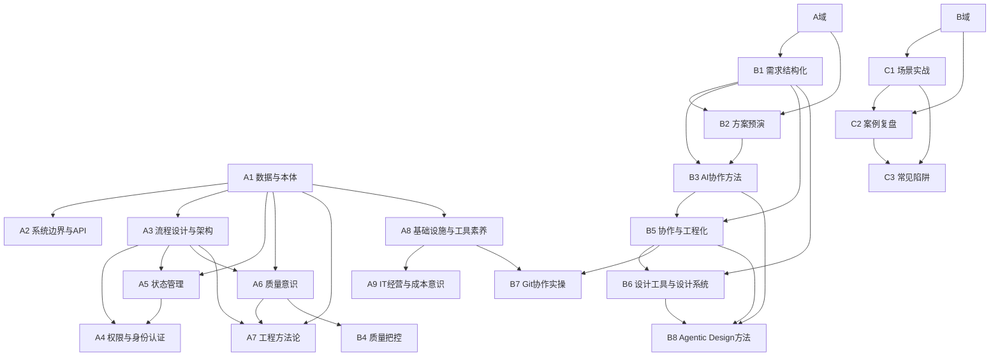

# 知识点地图

> 产品经理的小册子 - 知识体系与写作规划
> 版本：V2.0
> 更新日期：2026-04-18

---

## 一、地图设计目的

本知识点地图服务于以下目标：

1. **写作参考**：创作章节时，快速定位知识点、场景锚点、叙事线索
2. **批量规划**：规划并发写作任务，识别独立可并行的章节
3. **读者路径**：定义读者的学习路径和能力演进顺序
4. **质量验收**：每个知识点对应明确的验收标准

### 本书定位：地图而非教科书

本书的目标**不是**把每个知识点讲透、讲烂，而是：

- **给读者一张地图**：让读者从 high level 看清楚这些领域的大致轮廓和内部结构
- **标记「你应该知道但还不知道」的区域**：很多基础概念（SSH、CDN、DNS、MVC...）不在产品经理的日常知识空间里，但一旦参与工程协作就会频繁遇到。本书帮读者识别这些盲区
- **导向可获得的学习资源**：每个知识点应附上推荐的学习路径（如 Bilibili 课程、官方文档、经典书籍），让读者能快速自行补齐短板
- **降低「不知道自己不知道」的风险**：产品经理最大的认知陷阱不是「不懂技术」，而是「不知道自己还需要懂什么」

---

## 二、知识域总览

全书知识体系分为 **三大域、二十模块**：

```
┌───────────────────────────────────────────────────────────────────────────────┐
│                              知识点地图总览                                     │
├───────────────────────────────────────────────────────────────────────────────┤
│                                                                               │
│  ┌──────────────────────┐  ┌──────────────────────┐  ┌──────────────────┐    │
│  │   认知域               │  │   方法域               │  │   实践域          │    │
│  │ Domain A (9模块)      │  │ Domain B (8模块)      │  │ Domain C (3模块) │    │
│  ├──────────────────────┤  ├──────────────────────┤  ├──────────────────┤    │
│  │ • 数据与本体           │  │ • 需求结构化           │  │ • 场景实战        │    │
│  │ • 系统边界与API        │  │ • 方案预演             │  │ • 案例复盘        │    │
│  │ • 流程设计与架构       │  │ • AI协作方法           │  │ • 常见陷阱        │    │
│  │ • 权限与身份认证       │  │ • 质量把控             │  │                  │    │
│  │ • 状态管理             │  │ • 协作与工程化         │  │                  │    │
│  │ • 质量意识             │  │ • 设计工具与设计系统   │  │                  │    │
│  │ • 工程方法论           │  │ • Git协作实操          │  │                  │    │
│  │ • 基础设施与工具素养   │  │ • Agentic Design 方法  │  │                  │    │
│  │ • IT经营与成本意识     │  │                       │  │                  │    │
│  └──────────────────────┘  └──────────────────────┘  └──────────────────┘    │
│                                                                               │
│  学习顺序: A → B → C（认知打底 → 方法赋能 → 实践巩固）                         │
│                                                                               │
└───────────────────────────────────────────────────────────────────────────────┘
```

---

## 三、认知域（Domain A）详细知识点

> 认知域是全书基础，解决"听不懂"痛点。读者完成此域学习后，能理解开发说的技术方案。

### 模块 A1：数据与本体

| KP编号 | 知识点 | 核心概念 | 典型场景 | 故事锚点 | 前置依赖 |
|--------|--------|----------|----------|----------|----------|
| A1-01 | 数据是什么 | 数据是信息的载体，有类型、格式、约束 | 业务提需求说"存一个字段"，开发问"什么类型？" | 老李："我让业务说清楚字段类型，开发才肯开工" | 无 |
| A1-02 | 数据结构 | 数据的组织方式：字段、表、关系 | PRD写"用户信息"，开发问"有哪些字段？必填吗？" | 小想用AI生成字段表，漏了"手机号格式校验" | A1-01 |
| A1-03 | 数据流转 | 数据从输入到输出的路径 | 业务问"数据怎么从A到B"，开发说"要经过三个系统" | 老李画数据流图，发现漏了"异常数据怎么处理" | A1-01, A1-02 |
| A1-04 | 数据约束 | 数据的规则限制：格式、范围、唯一性 | 上线后发现"重复数据"，开发说"你没说不能重复" | 小想PRD没写唯一性约束，导致脏数据 | A1-02 |
| A1-05 | 数据存储 | 数据库的基本概念：表、索引、查询 | 开发说"这个查询会慢"，产品问"为什么？" | 老李："数据量大时，查询要考虑索引" | A1-01, A1-02 |
| A1-06 | 数据建模与本体 | 本体工作法（Ontology）：将业务实体、关系、规则抽象为数据模型；Palantir 的本体驱动方法；TOGAF（OpenGroup）数据架构层；华为/一汽等企业的数据治理实践 | 开发说"先定义数据模型"，产品问"模型和表有什么区别？" | 老李："Palantir 之所以厉害，不是因为技术多先进，而是它把数据的本体关系理清了。华为那套基于 TOGAF 的数据架构，本质也是把业务对象之间的关系建模抽象正确" | A1-01, A1-02 |
| A1-07 | 工程化反直觉认知 | 数据工程中违反直觉的事实：查一张表可能涉及多表 JOIN、索引选择、分库分表；数据一致性比想象中难；数据迁移是高风险操作 | 产品说"就查个表嘛"，开发说"这个查询要关联 5 张表" | 老李："很多产品以为查个数据很简单，实际上背后可能涉及跨库查询、缓存一致性、分页性能，这些都是反直觉的" | A1-05, A1-06 |

**模块验收标准**：
- [ ] 能识别需求中的数据字段和类型
- [ ] 能描述数据从输入到输出的流转路径
- [ ] 能发现数据约束遗漏并补齐
- [ ] 能理解本体/数据建模的核心思路，知道为什么"把数据模型抽象正确"是最重要的事
- [ ] 能识别数据工程中的反直觉场景，不再轻视"查个表"背后的复杂性

**推荐学习资源**：
- 📖《数据密集型应用系统设计》（DERTA / Designing Data-Intensive Applications）—— Martin Kleppmann，数据工程领域圣经
- 📺 Bilibili 搜索「数据库原理」「数据建模入门」，推荐看 MySQL 入门系列
- 🔗 Palantir Foundry Ontology 官方文档：理解本体驱动的数据建模思路
- 📖《TOGAF 标准（第 10 版）》数据架构章节 —— OpenGroup 官网可获取

---

### 模块 A2：系统边界与API

| KP编号 | 知识点 | 核心概念 | 典型场景 | 故事锚点 | 前置依赖 |
|--------|--------|----------|----------|----------|----------|
| A2-01 | 接口是什么 | 系统间交互的约定：输入、输出、规则 | 开发说"调接口"，产品问"什么接口？" | 老李："接口就像餐厅窗口，你点菜，它给你饭" | A1-01 |
| A2-02 | 接口参数 | 接口的输入输出定义 | 开发问"接口传什么参数？"，产品说"就传用户ID" | 小想漏了"分页参数"，导致数据拉不全 | A2-01 |
| A2-03 | 系统依赖 | 一个系统依赖其他系统的方式 | 开发说"这个功能要等XX系统上线才能做" | 老李发现排期漏了"依赖系统上线时间" | A2-01, A2-02 |
| A2-04 | 集成方式 | 系统间连接的技术手段：API、消息、文件 | 开发说"要用消息队列"，产品问"为什么不直接调接口？" | 老李解释："有些场景不能用同步调用" | A2-01, A2-03 |
| A2-05 | 边界条件 | 系统运行的限制范围 | 上线后系统崩溃，开发说"超出边界了" | 小想没考虑"并发上限"，系统压垮了 | A2-01 |
| A2-06 | API设计原则 | 有了数据表不等于一对一设计API；DTO（数据传输对象）的必要性：API返回的数据结构≠数据库表结构；接口粒度设计：过粗导致传输浪费，过细导致调用次数爆炸 | 产品问"一个表对一个接口不就行了？"，开发解释"前端需要的数据跨了三张表" | 老李："API 是给调用者用的，不是给数据库用的。你需要 DTO 来裁剪和组合数据，而不是把表结构直接暴露出去" | A2-01, A2-02, A1-02 |
| A2-07 | API常见问题 | N+1 问题：查列表时逐条查详情导致性能灾难；批量 vs 逐条接口设计；分页、排序、过滤的标准化；接口幂等性 | 页面加载特别慢，开发说"你这个列表页每一行都要单独查一次详情接口" | 小想设计了一个列表页需求，上线后发现加载要 10 秒。老李复盘："这就是经典的 N+1 问题，列表 100 条数据，后台查了 101 次数据库" | A2-06 |

**模块验收标准**：
- [ ] 能理解开发说的"接口"是什么意思
- [ ] 能识别需求涉及的系统依赖关系
- [ ] 能发现边界条件遗漏并追问
- [ ] 能理解"数据表≠API"的设计原则，理解 DTO 存在的意义
- [ ] 能识别 N+1 等常见 API 性能问题的场景

**推荐学习资源**：
- 📖《RESTful Web APIs》—— Leonard Richardson，理解 API 设计的经典著作
- 📺 Bilibili 搜索「RESTful API 入门」「接口设计」
- 🔗 Swagger / OpenAPI 官方文档：学会看 API 文档
- 📖《微服务设计》（Building Microservices）—— Sam Newman，理解系统边界和服务拆分

---

### 模块 A3：流程设计与架构

| KP编号 | 知识点 | 核心概念 | 典型场景 | 故事锚点 | 前置依赖 |
|--------|--------|----------|----------|----------|----------|
| A3-01 | 业务流程 | 用户完成目标的操作序列 | 业务说"用户提交审批"，开发问"审批有几步？" | 老李画审批流程，发现漏了"驳回后怎么处理" | 无 |
| A3-02 | 系统流程 | 系统处理请求的内部逻辑 | 开发说"后台要做XX流程"，产品问"为什么这么多步骤？" | 小想："我以为提交就完了，原来后台还有5步" | A3-01, A1-03 |
| A3-03 | 异常流程 | 非正常情况的处理路径 | 上线后用户投诉"流程卡住了"，发现漏了异常处理 | 老李："流程设计最容易漏的是异常流" | A3-01, A3-02 |
| A3-04 | 流程与状态 | 流程推进依赖状态变化 | 开发说"要状态机"，产品问"什么意思？" | 老李解释状态机和流程的关系 | A3-01, A5-01 |
| A3-05 | 流程编排 | 多流程协同的设计 | 业务说"两个流程要并行"，开发问"怎么协调？" | 小想设计并行流程，忘了"冲突怎么处理" | A3-01, A3-02 |
| A3-06 | 活动定义（TOGAF） | 流程最细颗粒度是"活动"（Activity）；每个活动需关联：所属信息系统与业务模块、操作角色、是否关键决策点、输入物、输出物；活动的前后连接构成详细流程；借鉴 TOGAF 业务架构层的流程建模方法 | 老李让小想定义一个审批流程的每个活动，小想只写了"提交→审批→完成"三步 | 老李："你这叫流程吗？每个活动，谁在哪个系统里操作，输入什么输出什么，是不是决策点，这些都要写清楚。TOGAF 里把活动定义这么细是有道理的" | A3-01, A3-02 |
| A3-07 | 流程架构与作业指导书 | 活动→详细流程→作业指导书（SOP）→流程架构→领域完整自闭环；流程的层级关系：从单个活动到端到端流程再到流程全景图 | 老板问"我们的业务流程全景图在哪？"，没人能拿出来 | 老李："流程不是画一张图就完了。每个流程下面有作业指导书，流程和流程之间还要拼成流程架构，最终形成一整个业务域的闭环运行体系" | A3-06 |
| A3-08 | 流程遵从性检查 | 流程定义完成后需要持续检查是否被遵守；流程审计与合规；流程偏离的识别与纠正 | 流程定义了但没人执行，上线半年发现大家都在"绕着走" | 老李："流程不光要定义，还要检查有没有被执行。很多公司流程写了一堆，实际执行的不到一半" | A3-07 |
| A3-09 | 业务流程挖掘的困难 | 信息系统设计最难的不是开发技术，而是业务本身；业务人员难以清晰描述自己的工作流程；组织政治因素：业务人员担心流程透明化后暴露"低价值"工作，不愿详细说明；需要产品经理有耐心和技巧去引导挖掘 | 产品去调研业务流程，业务只说"我们就是审批一下"，实际操作有 20 个细节步骤 | 老李："业务说不清流程是常态，不是例外。有些人是真说不清，有些人是不想说清——说太清楚了怕老板觉得自己没干啥有价值的事。你得有耐心，用场景反推，别指望别人给你画好流程图" | A3-06 |
| A3-10 | 流程复用与治理 | 业务流程有可复用的部分（通用审批、通知、归档等）；流程治理：识别并裁剪不在价值流上的冗余流程；避免部门为证明存在感而膨胀出无人消费的流程和交付物 | 几个业务线各自开发了审批流程，逻辑几乎一样但互不通用 | 老李："流程也有复用性。通用的审批、通知、归档应该抽象出来。另外，很多流程和交付物其实没人消费，就是某个部门为了刷存在感加的。这些要治理掉" | A3-07, A3-08 |
| A3-11 | 流程持续演进 | 流程一旦建立就会持续演进，不会一成不变；流程变更需对应 IT 系统的匹配改进；通过流程改进提升整体作业效率；流程变更管理机制 | 业务说"流程改了"，IT 系统还是老逻辑，导致线上线下不一致 | 小想："流程不是一次性的事？" 老李："当然不是。流程会随业务持续变化，关键是变化时 IT 系统要跟上。很多线上bug不是代码问题，而是流程变了系统没变" | A3-07, A3-10 |
| A3-12 | 行业流程标准框架 | 行业已有的流程参考框架：APQC（美国生产力与质量中心流程分类框架）、eTOM（电信行业流程框架）、ITIL（IT 服务管理流程）、SCOR（供应链流程参考模型）；为什么要先了解行业有没有现成的流程框架再造自己的 | 产品从零设计业务流程，发现和行业标准完全不兼容 | 老李："你在造流程之前先查一下行业有没有现成的框架。APQC 把企业流程分成了 13 个大类，ITIL 把 IT 运维流程定义得明明白白。不要闭门造车，先看看前人的成果" | A3-07 |

**模块验收标准**：
- [ ] 能画出完整的业务流程图（含异常流）
- [ ] 能区分业务流程和系统流程
- [ ] 能识别流程设计中的遗漏点
- [ ] 能按 TOGAF 活动定义标准描述一个流程活动（角色、系统、决策点、输入/输出）
- [ ] 能理解流程架构的层级关系（活动→流程→作业指导书→流程架构→业务域闭环）
- [ ] 能识别流程挖掘中的组织阻力和应对策略
- [ ] 能判断一个流程是否在价值流上，识别可裁剪的冗余流程
- [ ] 能查阅并参考行业标准流程框架（APQC、eTOM、ITIL 等）

**推荐学习资源**：
- 📖《TOGAF 标准（第 10 版）》业务架构篇 —— OpenGroup 官网
- 🔗 APQC 流程分类框架（Process Classification Framework）—— apqc.org 官网可下载
- 📖《ITIL 4 Foundation》—— IT 服务管理入门必读
- 📺 Bilibili 搜索「业务流程管理 BPM」「BPMN 建模入门」
- 📖《流程圣经》（Process Mapping）—— 理解流程设计和优化的基本方法

---

### 模块 A4：权限与身份认证

| KP编号 | 知识点 | 核心概念 | 典型场景 | 故事锚点 | 前置依赖 |
|--------|--------|----------|----------|----------|----------|
| A4-01 | 权限是什么 | 用户能做什么、不能做什么的控制 | 业务说"所有人都能看"，开发问"包括离职员工？" | 老李："权限就是谁能干什么" | 无 |
| A4-02 | 角色权限 | 按角色分配权限的方式 | 开发问"有哪些角色？每个角色能干什么？" | 小想漏了"临时角色"，导致权限混乱 | A4-01 |
| A4-03 | 数据权限 | 不同角色能看的数据范围 | 业务说"经理看全部"，开发问"跨部门的数据能看吗？" | 老李发现数据权限设计漏了"组织边界" | A4-01, A4-02 |
| A4-04 | 操作权限 | 不同角色能执行的操作 | PRD写"经理可以审批"，开发问"能驳回吗？能撤回吗？" | 小想写权限，漏了"批量操作权限" | A4-01, A4-02 |
| A4-05 | 权限继承 | 权限传递和覆盖的规则 | 业务说"上级自动有下级权限"，开发问"全部继承还是部分？" | 老李追问权限继承边界 | A4-02 |
| A4-06 | 权限管理框架 | 行业标准权限模型：RBAC（基于角色）、ABAC（基于属性）、ACL（访问控制列表）；框架选型依据；企业级权限架构设计模式 | 开发问"权限用什么模型？RBAC 还是 ABAC？"，产品完全听不懂 | 老李："不同场景适合不同权限框架。RBAC 简单适合大多数场景，ABAC 灵活适合复杂场景。你不需要会实现，但得知道选型的依据" | A4-02, A4-05 |
| A4-07 | 认证与登录体系 | 登录系统设计：认证（Authentication）vs 授权（Authorization）；SSO（单点登录）的必要性和原理；IDaaS（Identity as a Service）趋势；主流身份服务（Okta、Auth0、Azure AD 等）；为什么认证应尽量基于基础设施而非自建 | 新系统要加登录功能，开发问"自己做还是接公司统一登录？" | 老李："登录系统千万别自己造轮子。你知道为什么大公司都在搞 SSO 和 IDaaS 吗？因为每个系统各自搞一套账号密码，管理成本和安全风险都会爆炸" | A4-01, A4-06 |
| A4-08 | 隐私合规与数据保护 | 国家关于公民隐私的 IT 系统开发要求（个人信息保护法、GDPR 等）；企业内部 IT 系统的合规义务；为什么隐私要求进一步推动了基础设施化的认证方案 | 上线后收到法务警告："用户手机号不能明文存储" | 老李："隐私合规不是可选的，是法律要求。个人信息保护法出来之后，用户数据的存储、传输、展示都有硬规定。这也是为什么认证一定要用基础设施——自建的根本过不了合规审计" | A4-07 |

**模块验收标准**：
- [ ] 能识别需求中的权限要素（角色、数据、操作）
- [ ] 能设计基本的权限矩阵
- [ ] 能发现权限设计遗漏并追问
- [ ] 能区分 RBAC、ABAC 等权限框架的适用场景
- [ ] 能理解 SSO 和 IDaaS 的必要性，能判断何时应该用统一认证而非自建
- [ ] 能识别隐私合规对系统设计的约束

**推荐学习资源**：
- 📖《OAuth 2 in Action》—— 理解现代认证授权协议
- 🔗 Auth0 官方文档（auth0.com/docs）—— IDaaS 最佳实践参考
- 📺 Bilibili 搜索「RBAC 权限模型」「OAuth2 入门」
- 📖《个人信息保护法》全文 + 国家网信办指南 —— 合规必读

---

### 模块 A5：状态管理

| KP编号 | 知识点 | 核心概念 | 典型场景 | 故事锚点 | 前置依赖 |
|--------|--------|----------|----------|----------|----------|
| A5-01 | 状态是什么 | 系统在某一时刻的数据情况 | 开发说"订单状态变了"，产品问"有哪些状态？" | 老李："状态就像电表读数，反映当前情况" | 无 |
| A5-02 | 状态流转 | 状态变化的规则和路径 | PRD写"订单完成"，开发问"从哪个状态跳到完成？" | 小想画状态图，漏了"取消状态" | A5-01 |
| A5-03 | 状态约束 | 状态跳转的限制条件 | 开发说"这个状态不能直接跳到那个状态" | 老李追问："什么情况下能跳？什么不能？" | A5-01, A5-02 |
| A5-04 | 状态冲突 | 多操作同时影响状态的场景 | 上线后发现"状态乱了"，开发说"并发问题" | 小想没考虑"两个人同时操作订单" | A5-02, A5-03 |
| A5-05 | 状态机 | 状态流转的规则系统 | 开发说"要设计状态机"，产品问"怎么设计？" | 老李教小想设计状态机 | A5-01, A5-02, A5-03 |

**模块验收标准**：
- [ ] 能识别需求中的状态要素
- [ ] 能画出状态流转图
- [ ] 能识别状态约束和并发风险

**推荐学习资源**：
- 📺 Bilibili 搜索「状态机 入门」「有限状态机」
- 🔗 XState 官方文档（stately.ai）—— 可视化状态机工具，帮助理解状态流转设计

---

### 模块 A6：质量意识

| KP编号 | 知识点 | 核心概念 | 典型场景 | 故事锚点 | 前置依赖 |
|--------|--------|----------|----------|----------|----------|
| A6-01 | 验收标准 | 确认需求完成的具体条件 | 开发说"做完了"，产品问"怎么验证？" | 老李："验收标准就是签收快递的检查清单" | 无 |
| A6-02 | 测试场景 | 验证功能的各种情况 | 开发问"要测哪些场景？"，产品说"正常流程就行" | 小想漏了异常场景，上线后出bug | A6-01 |
| A6-03 | 边界测试 | 极端情况的验证 | 上线后发现"大量数据时系统崩溃" | 老李："测试要覆盖边界情况" | A6-01, A6-02 |
| A6-04 | 回归测试 | 修改后重新验证原有功能 | 上线新功能后旧功能出问题，开发说"没测" | 小想不懂回归测试，以为改了就行 | A6-01, A6-02 |
| A6-05 | 监控与告警 | 持续观察系统状态 | 上线后出问题才发现，开发说"没有监控" | 老李强调监控的重要性 | A6-01 |

**模块验收标准**：
- [ ] 能为需求定义验收标准
- [ ] 能识别测试场景遗漏
- [ ] 能理解监控的重要性

**推荐学习资源**：
- 📖《Google 软件测试之道》—— 理解测试思维和质量文化
- 📺 Bilibili 搜索「软件测试入门」「测试用例设计」

---

### 模块 A7：工程方法论

> 现代软件工程中涌现的方法论，产品经理不需要精通实现，但需理解核心理念以更好地与工程团队协作。

| KP编号 | 知识点 | 核心概念 | 典型场景 | 故事锚点 | 前置依赖 |
|--------|--------|----------|----------|----------|----------|
| A7-01 | DDD 领域驱动设计 | 以业务领域为核心组织软件架构；限界上下文（Bounded Context）划分业务边界；通用语言（Ubiquitous Language）统一业务和技术概念；实体、值对象、聚合根等核心抽象 | 开发说"这两个模块属于不同的限界上下文"，产品问"什么意思？" | 老李："DDD 的核心其实是让技术人员和业务人员说同一种语言。当开发说'限界上下文'，他其实在说'这是两块不同的业务，不能混在一起'" | A1-06, A3-06 |
| A7-02 | TDD 测试驱动开发 | 先写测试再写代码；红-绿-重构循环；TDD 对需求清晰度的要求——需求越模糊，测试越写不出来 | 开发说"你的需求我没法写测试用例"，产品以为开发在找借口 | 老李："TDD 要求先写测试再写代码，这意味着需求必须足够清晰和可验证。如果开发说写不出测试用例，很可能是你的需求还不够明确" | A6-01, A6-02 |
| A7-03 | TOGAF 企业架构 | OpenGroup 企业架构框架；四大架构域：业务架构、数据架构、应用架构、技术架构；ADM（架构开发方法）；华为、一汽等企业的 TOGAF 实践；企业架构对产品设计的约束和指导 | 架构师说"这个需求要过架构评审"，产品不理解为什么不能直接开发 | 老李："大公司的 IT 建设不是想做什么就做什么。TOGAF 把企业架构分成业务、数据、应用、技术四层，你的需求必须在这个框架内对齐，否则就是在造孤岛" | A1-06, A3-07 |
| A7-04 | DevOps 与持续交付 | 开发与运维融合；CI/CD 持续集成持续交付；环境管理（开发/测试/预发/生产）；灰度发布、蓝绿部署；为什么理解交付流程能帮助产品更好地规划发版 | 产品问"改一行字什么时候能上线？"，开发说"要走发布流程" | 小想："改一行文案为什么要等两天？" 老李解释发布流程和环境管理 | A6-05 |
| A7-05 | MVC 等架构模式 | MVC（Model-View-Controller）：把系统分成数据层、展示层、控制层的经典模式；MVVM、MVP 等变体；前后端分离架构；为什么理解架构分层能帮助产品理解"改前端"和"改后端"的区别 | 产品说"就改个页面显示"，开发说"要改后端接口" | 老李："MVC 把系统分成了三层。你以为改个显示是前端的事，但如果数据字段变了，后端的 Model 和接口都要改。所以你问开发'为什么改个显示要这么久'，他不是在偷懒" | A1-02, A2-01 |
| A7-06 | CQRS 与事件溯源 | CQRS（命令查询职责分离）：读和写走不同的模型和路径，适合读写负载差异大的场景；Event Sourcing（事件溯源）：不存最终状态，而是存所有变化事件，可重放历史；这两个模式经常一起出现 | 开发说"这个功能要用 CQRS"，产品问"为什么不能直接读写同一张表？" | 老李："有些系统读的量是写的 100 倍，或者需要完整的操作历史审计。CQRS 和 Event Sourcing 就是为这种场景设计的。你不需要写代码，但得理解为什么开发要这样拆" | A1-05, A5-05 |

**模块验收标准**：
- [ ] 能理解 DDD 限界上下文对系统拆分的影响
- [ ] 能理解 TDD 对需求清晰度的倒逼作用
- [ ] 能理解企业架构框架对产品设计的约束
- [ ] 能理解 CI/CD 发布流程，合理预期上线节奏
- [ ] 能理解 MVC 等分层架构，区分前端/后端改动的不同影响
- [ ] 能在开发提出 CQRS / Event Sourcing 时理解其适用场景

**推荐学习资源**：
- 📖《领域驱动设计》（Domain-Driven Design）—— Eric Evans，DDD 开山之作（建议先看精简版《领域驱动设计精粹》）
- 📖《测试驱动开发》（Test-Driven Development: By Example）—— Kent Beck
- 📖《TOGAF 标准（第 10 版）》—— OpenGroup 官网
- 📺 Bilibili 搜索「DDD 领域驱动设计 入门」「DevOps 入门」「CICD 流水线」
- 📖《持续交付》（Continuous Delivery）—— Jez Humble & David Farley

---

### 模块 A8：基础设施与工具素养

> 产品经理不需要精通每个工具，但需要知道这些东西的存在、大致作用，以及在什么场景会遇到。本模块定位为「你应该知道但可能还不知道的知识索引」，每个知识点附自学资源导向。

| KP编号 | 知识点 | 核心概念 | 典型场景 | 故事锚点 | 前置依赖 |
|--------|--------|----------|----------|----------|----------|
| A8-01 | IDE 与 AI IDE | 集成开发环境（IDE）：开发写代码的核心工具。主流 IDE 包括 VS Code（微软出品，免费，插件生态最大）、JetBrains 系列（IntelliJ、WebStorm 等，专业级付费工具）、Xcode（苹果生态）；IDE 不是记事本，集成了语法高亮、调试、版本管理、终端、AI 辅助等能力；AI IDE 新物种：Cursor（基于 VS Code 的 AI 原生 IDE）、Windsurf 等，把 AI 对话和代码编辑融为一体；为什么产品经理也需要了解 IDE——在 Agentic 时代，产品用 Cursor 可以直接和 AI 协作写需求文档、做原型验证、甚至生成简单代码 | 小想看到开发屏幕上花花绿绿的界面问"这是什么软件"；后来自己装了 Cursor 用 AI 写需求 | 老李："IDE 是开发的武器，就像设计师离不开 Figma 一样。VS Code 免费好用插件多，JetBrains 专业但收费。现在像 Cursor 这种 AI IDE，产品也能用——不是让你写代码，而是让 AI 帮你做事时，你需要一个能和 AI 深度协作的环境" | 无 |
| A8-02 | Git 基础认知 | 版本控制系统：记录文件每次变更的历史；分支、合并、冲突的基本概念；GitHub/GitLab 平台的作用；为什么 Git 不只是程序员的工具 | 开发问"你改了哪里？"，产品说"你自己对比一下上次那版" | 老李："Git 就是一个时光机，能看到每次改了什么、谁改的、为什么改。产品也应该学会用这个思维管理需求变更" | 无 |
| A8-03 | SSH 与服务器基础 | SSH（安全远程连接）：登录服务器的标准方式；服务器的基本概念：物理机、虚拟机、云服务器；Linux 命令行入门 | 运维说"SSH 到服务器上看一下日志"，产品完全听不懂 | 小想第一次听到 SSH 以为是一种加密算法 | 无 |
| A8-04 | 域名、DNS 与证书 | 域名系统（DNS）：把人类可读的网址翻译成机器 IP 地址；HTTPS 证书：保证网站安全的加密凭证；域名注册、备案、解析的流程；DNS 污染和劫持 | 新系统要上线，运维问"域名买了吗？SSL 证书呢？" | 小想："域名不就是个网址吗？为什么还要证书？" 老李解释 DNS 和 HTTPS 的作用 | 无 |
| A8-05 | CDN 与网络基础 | CDN（内容分发网络）：让用户就近访问，加速资源加载；带宽、延迟、路由的基本概念；为什么同一个网站在不同地方访问速度不同 | 用户投诉"你们网站好慢"，运维说"要加 CDN" | 小想不理解为什么要花钱买 CDN，老李用快递驿站的比喻解释 | 无 |
| A8-06 | 云服务与基础设施 | 云计算基本概念：IaaS/PaaS/SaaS；主流云厂商（AWS、阿里云、腾讯云等）；为什么系统要上云，什么时候不适合上云；容器化（Docker）的基本概念 | 开发说"部署到阿里云 ECS 上"，产品问"为什么不用自己的服务器" | 老李："自建机房就像自己盖仓库，上云就像租快递公司的仓库。大多数情况下租比自建划算" | A8-03 |
| A8-07 | 前端与后端 | 前端（用户看到的界面）vs 后端（服务器上的逻辑和数据）；浏览器/App 和服务器的通信方式；为什么"前端改一下"有时也需要后端配合 | 产品说"这个改起来很简单吧，就改个前端"，开发说"这个字段后端也要改" | 小想渐渐理解了"前端"和"后端"不是两个独立的世界 | A8-01 |
| A8-08 | 数据库与缓存 | 关系型数据库（MySQL、PostgreSQL）vs NoSQL（MongoDB、Redis）；缓存的作用：用空间换时间；为什么有些数据"查得慢"，有些"更新不及时" | 开发说"这个数据加了缓存需要等几分钟才更新"，产品不理解为什么不能实时 | 老李："数据库像图书馆的书架，缓存像你桌上的几本常用书。查桌上的快，但桌上的不一定是最新的" | A1-05 |
| A8-09 | 消息队列 | 消息队列（MQ）：系统之间异步通信的管道；主流产品：RabbitMQ、Kafka、RocketMQ；为什么不是所有请求都适合"直接调接口"——有些任务要排队、要削峰、要解耦；消息的生产者和消费者模型 | 开发说"这个订单创建后要发消息给库存系统"，产品问"为什么不直接调库存接口？" | 老李："消息队列就像餐厅的取号系统。高峰期不让所有人同时往厨房里挤，而是排好队一个个来。系统间也一样——直接调接口遇到流量高峰会崩，用消息队列排着来就稳了" | A2-04 |
| A8-10 | 日志与监控系统 | 日志系统：记录系统运行过程中每一步发生了什么（ELK Stack：Elasticsearch + Logstash + Kibana）；监控系统：实时观察系统健康状况（Prometheus + Grafana）；告警：系统异常时自动通知相关人员；为什么"出了问题查日志"是开发的第一反应 | 线上出了 Bug，产品问"怎么查原因？"，开发说"先看日志" | 小想第一次看到 Grafana 监控大屏，感叹"原来系统的心跳长这样"。老李："日志是系统的黑匣子，监控是系统的心电图。没有这两样，出了问题就是瞎猜" | A6-05 |
| A8-11 | API 网关 | API 网关（API Gateway）：所有外部请求进入系统的统一入口；承担的职责：路由转发、鉴权认证、限流熔断、日志记录、协议转换；主流产品：Kong、Nginx、AWS API Gateway、阿里云 API 网关；为什么不让外部直接访问后端服务 | 开发说"这个接口要过网关"，产品问"网关是什么？为什么不直接连后端？" | 老李："API 网关就像小区的门卫。所有访客先到门卫这登记、验身份，符合条件的才放进去。你不会让外人直接进你家门吧？系统也一样" | A2-01, A4-07 |

**模块验收标准**：
- [ ] 能辨识 IDE/Git/SSH 等基础工具的角色和用途，理解 VS Code/JetBrains/Cursor 的区别
- [ ] 能理解域名、DNS、HTTPS 证书的关系
- [ ] 能理解 CDN、云服务等基础设施的作用
- [ ] 能区分前端/后端、数据库/缓存，在与开发沟通时不说外行话
- [ ] 能理解消息队列的异步通信场景，知道"为什么不直接调接口"
- [ ] 能理解日志和监控系统的作用，知道"查日志"是排查问题的基本手段
- [ ] 能理解 API 网关作为系统统一入口的职责
- [ ] 知道自己「还不知道」的技术概念有哪些，能主动查阅学习

**推荐学习资源**：
- 📺 Bilibili 搜索「Linux 入门」「SSH 入门教程」「DNS 原理」「CDN 原理」
- 🔗 VS Code 官网（code.visualstudio.com）—— 免费下载，产品经理也可以装来体验
- 🔗 Cursor 官网（cursor.com）—— AI IDE，建议亲自体验一次
- 📖《鸟哥的 Linux 私房菜》—— Linux / 服务器入门经典
- 📺 Bilibili 搜索「Docker 入门」「云计算 入门」「消息队列 原理」
- 🔗 阿里云 / AWS 官方入门教程 —— 云服务概念快速了解
- 🔗 Apache Kafka 官方文档 / RabbitMQ 官方 Tutorials —— 消息队列入门
- 🔗 Elastic 官方文档（elastic.co）—— ELK 日志系统入门
- 🔗 Grafana 官方 Playground（play.grafana.org）—— 在线体验监控大屏

---

### 模块 A9：IT 经营与成本意识

> 定制软件不是「一次开发、永久免费」。本模块帮助产品经理理解 IT 系统的真实成本结构和组织运营模式。

| KP编号 | 知识点 | 核心概念 | 典型场景 | 故事锚点 | 前置依赖 |
|--------|--------|----------|----------|----------|----------|
| A9-01 | 系统开门成本 | 一套系统上线的最低成本：服务器、域名、证书、监控、日志、备份这些基础设施都是硬性开销；不写一行代码也有开门成本 | 老板说"做个小系统应该很便宜吧"，IT 报价远超预期 | 老李："还没写一行代码呢，服务器一年几千、域名几百、SSL 证书、监控告警、日志系统、数据备份……这些是开门就要花的钱" | A8-06 |
| A9-02 | 迭代与运维成本 | 系统上线后的持续投入：Bug 修复、需求迭代、安全补丁、依赖升级、数据运维；工程师的持续投入不是"有事才叫"的模式 | 系统上线半年没人维护，突然发现安全漏洞 | 小想以为系统上线就完了，老李解释运维的必要性 | A9-01 |
| A9-03 | 切换成本 | 换系统、换供应商、换技术栈的真实代价：数据迁移、业务中断、团队学习成本、历史数据兼容；为什么"重新做一个"往往比想象中贵得多 | 老板说"这系统不好用，换一个"，IT 评估后说"切换要半年" | 老李："切换成本是最容易被低估的。数据迁移、接口重对、业务重新培训，这些加起来比重新开发还贵" | A9-01, A9-02 |
| A9-04 | 人力弹性困境 | 定制软件能力是内部组织能力，不是"有项目就招人、没项目就裁"的外包模式；IT 团队需要持续维护知识沉淀和系统上下文；抖动太大导致能力断裂 | 公司业务淡季砍了一半 IT，旺季来了发现没人能支撑新需求 | 老李："IT 不是水龙头，拧开就有水。你把人裁了，系统的上下文、架构的理解、业务的积累全没了。等你再招人，新人要花半年才能上手，而这半年业务等得了吗？" | A9-02 |
| A9-05 | 业务+系统+运营耦合 | 传统的组织方式（业务归业务、IT 归 IT）效率低下；新模式：业务+系统+运营几个角色耦合在一起持续工作；业务变了 IT 立即响应，运营时刻监控系统；打破组织竖井才能实现真正的敏捷 | 业务提了需求三个月才上线，因为要走"跨部门流程" | 老李："以前是业务部门甩需求给 IT 部门，IT 部门排队做，做完甩给运营。现在应该是这三个角色贴在一起工作，业务一变，系统马上能跟" | A9-04 |

**模块验收标准**：
- [ ] 能识别一套系统的完整成本结构（开门成本+迭代成本+运维成本）
- [ ] 能理解切换成本和人力弹性困境，避免"重新做一个"的冲动决策
- [ ] 能理解业务+系统+运营耦合工作模式的优势

**推荐学习资源**：
- 📖《凤凰项目》（The Phoenix Project）—— Gene Kim，以小说形式讲 IT 运维与 DevOps 转型
- 📖《独角兽项目》（The Unicorn Project）—— Gene Kim，《凤凰项目》续作
- 📺 Bilibili 搜索「IT 成本管理」「技术债务」

---

## 四、方法域（Domain B）详细知识点

> 方法域解决"被拒绝无措"和"无法把控"痛点。读者完成此域学习后，能判断方案可行性、把控质量风险。

### 模块 B1：需求结构化

| KP编号 | 知识点 | 核心概念 | 典型场景 | 故事锚点 | 前置依赖 |
|--------|--------|----------|----------|----------|----------|
| B1-01 | 需求拆解 | 把模糊需求拆成结构化元素 | 业务说"做个审批功能"，产品问"审批什么？谁来审？几步？" | 小想用AI拆需求，发现漏了"审批规则" | A域全部 |
| B1-02 | 需求元素 | 需求的标准组成：数据、流程、权限、状态 | 开发说"需求不完整"，产品问"缺什么？" | 老李教小想需求元素框架 | B1-01 |
| B1-03 | 需求模板 | 结构化需求的标准化格式 | 开发说"需求看不懂"，产品改用模板后顺畅 | 小想套模板写需求，开发点赞 | B1-01, B1-02 |
| B1-04 | 需求完整性检查 | 检查需求是否遗漏的方法 | 需求评审时开发指出遗漏，产品复盘改进 | 老李分享完整性检查清单 | B1-02 |

**模块验收标准**：
- [ ] 能把模糊需求拆成结构化元素
- [ ] 能用模板写出开发看得懂的需求
- [ ] 能自查需求完整性

**推荐学习资源**：
- 📖《用户故事地图》（User Story Mapping）—— Jeff Patton，需求拆解经典方法
- 📖《探索需求》（Exploring Requirements）—— Gerald Weinberg
- 📺 Bilibili 搜索「PRD 怎么写」「需求分析方法」

---

### 模块 B2：方案预演

| KP编号 | 知识点 | 核心概念 | 典型场景 | 故事锚点 | 前置依赖 |
|--------|--------|----------|----------|----------|----------|
| B2-01 | 方案预演概念 | 在开发实现前先模拟方案效果 | 开发说"这个方案有问题"，产品问"怎么提前发现？" | 老李："方案预演就是先做样板间" | B1域 |
| B2-02 | AI辅助预演 | 用AI模拟技术实现 | 小想用AI预演方案，发现状态流转有漏洞 | 老李肯定AI预演的价值 | B2-01 |
| B2-03 | 边界检查 | 用预演发现边界问题 | AI预演后发现"并发时状态冲突" | 小想补上边界场景 | B2-01, B2-02 |
| B2-04 | 方案对比 | 预演多个方案选最优 | 两个方案都能实现，用预演对比优劣 | 老李教小想方案对比方法 | B2-01, B2-02 |

**模块验收标准**：
- [ ] 能用AI辅助预演技术方案
- [ ] 能通过预演发现边界问题
- [ ] 能对比多个方案优劣

**推荐学习资源**：
- 📺 Bilibili 搜索「原型设计」「低保真原型」
- 🔗 Claude / ChatGPT / Gemini 官方文档 —— 理解 AI 能力边界

---

### 模块 B3：AI协作方法

| KP编号 | 知识点 | 核心概念 | 典型场景 | 故事锚点 | 前置依赖 |
|--------|--------|----------|----------|----------|----------|
| B3-01 | AI能做什么 | AI在产品工作中的能力边界 | 小想让AI写完整需求，AI输出不完整 | 老李："AI是助手，不是替手" | B1域, B2域 |
| B3-02 | 提示词设计 | 给AI清晰指令的方法 | AI输出不理想，小想问"怎么写提示词？" | 老李教小想提示词框架 | B3-01 |
| B3-03 | AI辅助原型 | 用AI快速生成原型 | 小想用AI生成原型，节省大量时间 | 小想分享AI原型技巧 | B3-01, B3-02 |
| B3-04 | AI辅助测试用例 | 用AI生成测试场景 | 测试遗漏场景，小想用AI补齐 | 小想用AI生成测试用例 | B3-01, B3-02 |
| B3-05 | AI输出验证 | 判断AI输出是否可靠的方法 | AI输出有错误，小想没发现 | 老李强调要验证AI输出 | B3-01 |

**模块验收标准**：
- [ ] 能合理界定AI的能力边界
- [ ] 能设计有效的提示词
- [ ] 能验证AI输出可靠性

**推荐学习资源**：
- 📖《提示工程指南》—— promptingguide.ai（开源在线教程）
- 🔗 Anthropic Prompt Engineering 官方指南（docs.anthropic.com）
- 📺 Bilibili 搜索「提示词工程」「AI 辅助办公」

---

### 模块 B4：质量把控

| KP编号 | 知识点 | 核心概念 | 典型场景 | 故事锚点 | 前置依赖 |
|--------|--------|----------|----------|----------|----------|
| B4-01 | 质量风险识别 | 识别上线可能出问题的地方 | 老李问"上线最怕出什么问题？"小想列举风险 | 老李分享风险识别方法 | A6域 |
| B4-02 | 验收清单设计 | 设计系统化的验收检查项 | 上线后遗漏验收，导致问题 | 小想设计验收清单 | B4-01, A6-01 |
| B4-03 | 测试协同 | 与测试团队有效协作 | 测试说"测不透"，产品问"怎么帮？" | 老李教测试协同方法 | B4-01, A6域 |
| B4-04 | 发布把控 | 上线前的检查和准备 | 上线匆忙出问题，复盘改进 | 小想学习发布把控流程 | B4-01, B4-02 |
| B4-05 | 问题追溯 | 出问题后分析根因的方法 | 上线出bug，复盘找原因 | 老李分享问题追溯方法 | B4-01 |

**模块验收标准**：
- [ ] 能识别质量风险点
- [ ] 能设计验收清单
- [ ] 能追溯问题根因

**推荐学习资源**：
- 📖《Google 软件测试之道》—— James Whittaker 等，测试协同经典
- 📺 Bilibili 搜索「软件质量保障」「发布流程 DevOps」

---

### 模块 B5：协作与工程化

| KP编号 | 知识点 | 核心概念 | 典型场景 | 故事锚点 | 前置依赖 |
|--------|--------|----------|----------|----------|----------|
| B5-01 | 开发语言翻译 | 把业务语言翻译成开发能理解的 | 业务说"要快"，开发说"要时间"，产品翻译 | 老李翻译业务需求给开发 | 全域 |
| B5-02 | 技术方案讨论 | 与开发讨论技术方案的技巧 | 开发说方案，产品插不上话 | 老李教小想技术讨论技巧 | B5-01 |
| B5-03 | 异议处理 | 开发说"做不了"时如何应对 | 开发拒绝需求，产品不知道真假 | 老李分享异议处理方法 | B5-01, B5-02 |
| B5-04 | 排期协商 | 协商合理的开发时间 | 开发说"做不了那么快"，产品问"多久能做？" | 小想学习排期协商 | B5-01 |
| B5-05 | 评审准备 | 需求评审前的准备工作 | 评审时被开发问倒，产品复盘改进 | 小想准备评审，顺利通过 | B5-01, B5-02 |
| B5-06 | Git-like 工作方式 | 产品经理也学会 Git 化协作：版本管理思维、分支协作、PR/MR 评审流程、Issue 驱动开发；从"甩文档"到"协作式交付"的转变 | 开发说"你的需求文档改了哪里？"产品说"你自己看吧"，开发崩溃 | 老李："传统的排期、分工、甩文档模式正在变。未来产品要学会用 Git 思维管理需求——每次变更要有记录，用 Issue 追踪进度，用 PR 评审质量" | B5-05 |
| B5-07 | Human+Agent 协作模型 | 未来的披萨团队可能只有 1-2 个人+各自的 AI Agent；肉脑袋间的上下文切换成本高，Human-Agent 对内协作效率更高；跨组沟通演变为"Human+Agent 组"对"Human+Agent 组"；AI 智能提升后一个人可能覆盖一整个业务域 | 小想和老李讨论"为什么跨部门沟通这么累" | 老李："传统软件团队靠 5-8 个人的披萨团队，但人和人之间的上下文切换太贵了。未来的模式是每个人带着自己的 Agent，两个 Human+Agent 组之间沟通，跨的肉脑袋越少效率越高。甚至一个人就能撑起一整块业务域" | B5-06, B3域 |

**模块验收标准**：
- [ ] 能把业务语言翻译给开发
- [ ] 能参与技术方案讨论
- [ ] 能应对开发异议
- [ ] 能采用 Git-like 的版本管理和协作方式推进需求
- [ ] 能理解 Human+Agent 协作模型，为未来的工作方式做准备

**推荐学习资源**：
- 📖《人月神话》（The Mythical Man-Month）—— Fred Brooks，理解软件团队协作的经典
- 📺 Bilibili 搜索「敏捷开发入门」「Scrum 实践」
- 🔗 GitHub 官方教程（docs.github.com）—— 学习协作工具

---

### 模块 B6：设计工具与设计系统

> 产品经理日常设计工作中的核心工具、框架和设计系统思维，从战略定位到用户体验全覆盖。

| KP编号 | 知识点 | 核心概念 | 典型场景 | 故事锚点 | 前置依赖 |
|--------|--------|----------|----------|----------|----------|
| B6-01 | 价值主张画布 | Value Proposition Canvas：客户画像（痛点、收益、待办任务）与价值匹配（止痛药、收益助推器、产品服务）；用于验证产品-市场匹配 | 老板问"这个功能解决了什么痛点？"，产品说"用户要的" | 老李："你连用户的核心痛点和收益都没画出来，怎么知道功能做对了？先画个价值主张画布再说" | B1域 |
| B6-02 | 用户旅程图 | User Journey Map：完整描述用户与产品交互的全过程；触点、情绪曲线、痛点机会点；从发现到使用到离开的端到端视角 | 产品只关注功能本身，忽略了用户在使用前后的体验断点 | 小想画用户旅程图后发现：用户在注册环节就流失了 30%，功能再好也没用 | B1域 |
| B6-03 | 服务蓝图 | Service Blueprint：在用户旅程图基础上，增加前台交互、后台支撑、内部流程三层视角；可视化服务交付的全链路 | 用户投诉"客服说帮我查，结果等了三天"，产品才发现后台流程断了 | 老李："用户旅程图只看前台，服务蓝图还看后台。很多体验问题不在界面上，在后台流程里" | B6-02, A3域 |
| B6-04 | 商业模式画布 | Business Model Canvas：九大要素（客户细分、价值主张、渠道、客户关系、收入来源、核心资源、关键活动、重要伙伴、成本结构）的系统化梳理 | 产品做了很多功能但不赚钱，老板问"商业模式想清楚了吗？" | 老李："功能做得再好，商业模式不通也白搭。你得先想清楚九宫格里每个格子的答案" | B6-01 |
| B6-05 | 设计系统（Design System） | 什么是设计系统：统一的 UI Kit、组件库、设计规范、品牌素材的集合；为什么要先投入时间搭建设计系统再做具体设计（"一小时搭系统，之后每次自动套用"）；设计系统是团队协作的基础设施，而非个人偏好；公司全面推开可投入 1-2 周做系统沉淀，获得长期复利 | 多个产品线的界面风格完全不统一，用户体验割裂 | 老李："Anthropic 的设计师一个人管 7 条产品线，靠的就是先花时间把设计系统搭好。把品牌素材、UI Kit 全沉淀成标准组件，之后每个设计稿自动套风格。前面投入一小时，后面省一百小时" | B1域 |

**模块验收标准**：
- [ ] 能用价值主张画布验证产品功能是否对准用户痛点
- [ ] 能画出完整的用户旅程图，识别体验断点
- [ ] 能理解服务蓝图的前后台视角
- [ ] 能用商业模式画布做基本的商业模式分析
- [ ] 能理解设计系统的价值，知道何时该投入搭建设计系统

**推荐学习资源**：
- 📖《价值主张设计》（Value Proposition Design）—— Alexander Osterwalder
- 📖《商业模式新生代》（Business Model Generation）—— Alexander Osterwalder
- 📖《用户体验要素》（The Elements of User Experience）—— Jesse James Garrett
- 🔗 Figma 官方 Design System 教程 —— 设计系统搭建实操

---

### 模块 B7：Git 协作实操

> 产品经理不需要成为 Git 专家，但需要掌握 Git 化协作的基本操作和思维方式。

| KP编号 | 知识点 | 核心概念 | 典型场景 | 故事锚点 | 前置依赖 |
|--------|--------|----------|----------|----------|----------|
| B7-01 | Git 工作流基础 | Branch（分支）、Commit（提交）、Merge（合并）、Pull Request（合并请求）的工作流程；为什么每次改动都要有 commit message 记录变更原因 | 产品改了需求文档，开发问"你改了哪儿？"，产品说"你自己看" | 老李："每次改动都写清楚改了什么和为什么改，这不是开发的规矩，是所有协作者的规矩" | A8-02 |
| B7-02 | Issue 驱动开发 | 用 Issue 追踪所有待办项：需求、Bug、改进建议；Issue 和 代码/文档变更的关联；看板管理（To Do / In Progress / Done） | 产品在微信群里提需求，一周后问"做了吗"，开发说"我没看到" | 小想学会用 Issue 追踪需求后，再也没出过"需求丢了"的情况 | B7-01 |
| B7-03 | 代码评审 / 文档评审 | PR（Pull Request）/ MR（Merge Request）评审流程；为什么变更需要同行审查；产品如何参与需求文档的评审流程 | 开发提了个 PR 邀请产品 review 需求相关的改动 | 老李："评审不是在挑刺，是在质量保障。以前人做人审，现在 Claude 做人审——但审查这一步永远不能省，节奏和人力配置要调整" | B7-01, B5-06 |

**模块验收标准**：
- [ ] 能理解 Git 分支-提交-合并-评审的基本工作流
- [ ] 能使用 Issue 驱动的方式管理和追踪需求
- [ ] 能参与 PR/MR 评审流程

**推荐学习资源**：
- 🔗 GitHub 官方 Git 入门教程（docs.github.com/get-started）
- 📺 Bilibili 搜索「Git 入门教程」「GitHub 使用教程」
- 🔗 Atlassian Git 教程（atlassian.com/git）—— 图文并茂的 Git 学习资源

---

### 模块 B8：Agentic Design 方法

> AI 时代的设计和产品工作方法论，从设计师和产品经理如何与 AI Agent 协作的角度出发。

| KP编号 | 知识点 | 核心概念 | 典型场景 | 故事锚点 | 前置依赖 |
|--------|--------|----------|----------|----------|----------|
| B8-01 | AI 辅助设计的协作模式 | 跳出「设计师出稿→甩给工程师→工程师实现→回来修改」的接力模式；新模式：设计师和工程师一起看着 AI 画布，边讨论边敲定方案，一场会直接定下来开发 | 设计和开发来回改了五轮，耗时两个月 | 老李："新的协作方式不是你画完我做完再改，而是大家坐在一起，AI 实时出稿，一场会搞定" | B5-07, B6-05 |
| B8-02 | 结构级大改 vs 细节微调 | 大改（换布局、新增模块、深色模式、多方向探索）适合用 AI 聊天界面；小改（按钮 padding、颜色微调、组件替换）适合在元素上直接评论标注；区分「做什么」和「调什么」 | 产品让 AI 改一个按钮颜色，结果 AI 把整个页面重新生成了 | 小想学会了区分大改和小改的指令方式后，AI 输出的准确率大幅提升 | B8-01 |
| B8-03 | 给 AI 精准反馈 | 「看着不对劲」是最差反馈，「表单字段间距改成 8px」才是 AI 能执行的指令；AI 擅长处理具象具体的要求，不擅长揣摩抽象审美情绪；学会把感觉转化为具体参数 | AI 出了一版设计，产品说"感觉不太行"，AI 改了五版越改越离谱 | 老李："你对人说'感觉不太行'都不行，更别说对 AI 了。你得告诉它具体哪里不行——间距大了？颜色重了？层级不对？说清楚" | B8-01, B3-02 |
| B8-04 | 上下文喂给 AI | 把代码库、设计稿、品牌素材、会议纪要等喂给 AI，让它理解完整上下文后输出方案；精准挂载（只挂目标组件的文件夹/package，排除 .git 和 node_modules）；多开几个 Chat 平行探索不同方向再择优合并 | 小想把整个仓库拖进 AI，浏览器卡死了 | 老李："别把整个 monorepo 塞进去，只挂你需要的部分。另外，同一个想法开三个对话平行跑，比在一个对话里反复折腾高效得多" | B8-01, B3-01 |
| B8-05 | Agentic Design 的边界 | AI 能干复杂又综合的脑力活（从会议纪要生成解决方案 Deck），但新图标、核心插画、品牌形象、产品命名这些考验个人品味和判断力的事不能完全依赖 AI；这是"Agentic Design 的艺术部分" | 小想让 AI 设计 Logo，出了 20 版都不满意 | 老李："让 AI 干那些综合的、繁琐的脑力活；但品牌灵魂、核心美学这些事得你自己拿主意。这不是 AI 不够好，而是这活儿本质上考的是你的品味" | B8-01, B3-05 |
| B8-06 | 团队审查流程重构 | AI 时代从"人做、人审"变成"AI 做、人审"；审查环节必须重构：节奏加快、人力配置调整、审查标准明确化；不调整审查流程，AI 工具的价值浪费一半 | 团队引入 AI 工具后产出量暴增，但审查跟不上，质量反而下降 | 老李："工具进化了，流程也得跟着变。以前一个人一天出一稿审一稿，现在 AI 一天出十稿你还一个个慢慢审？审查标准和节奏必须重新设计" | B8-01, B4域 |

**模块验收标准**：
- [ ] 能区分适合 AI 大改和微调的任务类型
- [ ] 能给 AI 提供具象精准的反馈指令，而非模糊情绪
- [ ] 能合理管理 AI 上下文（精准喂料、平行探索）
- [ ] 能识别 Agentic Design 的能力边界（AI 干脑力活，人定品味）
- [ ] 能推动团队调整审查流程以适应 AI 协作节奏

**推荐学习资源**：
- 🔗 Cursor 官网（cursor.com）—— 产品经理体验 AI IDE 协作的最佳入口
- 🔗 Anthropic Claude 官方文档（docs.anthropic.com）—— 理解 AI 能力边界和最佳用法
- 📺 Bilibili 搜索「Cursor 教程」「AI 辅助设计」「Agentic Design」
- 🔗 v0.dev（Vercel）—— AI 生成 UI 的在线体验工具

---

## 五、实践域（Domain C）详细知识点

> 实践域综合运用认知和方法，解决实际问题。读者完成此域学习后，能独立应对常见场景。

### 模块 C1：场景实战

| KP编号 | 知识点 | 核心概念 | 典型场景 | 故事锚点 | 前置依赖 |
|--------|--------|----------|----------|----------|----------|
| C1-01 | 审批流程实战 | 完整设计一个审批功能 | 业务提审批需求，产品从零设计 | 老李带小想完整实战审批流程 | A+B域 |
| C1-02 | 权限系统实战 | 完整设计一个权限模型 | 业务提权限需求，产品设计权限矩阵 | 小想独立设计权限系统 | A4域, B域 |
| C1-03 | 数据报表实战 | 完整设计一个数据查询功能 | 业务提报表需求，产品设计数据方案 | 小想设计报表，漏了数据权限 | A1域, A4域, B域 |
| C1-04 | 状态流转实战 | 完整设计一个状态机 | 业务提订单需求，产品设计订单状态 | 小想设计订单状态机 | A5域, B域 |
| C1-05 | 多系统集成实战 | 设计跨系统的功能 | 业务提跨系统需求，产品设计方案 | 老李带小想设计多系统集成 | A2域, B域 |

**模块验收标准**：
- [ ] 能独立完成常见场景的完整设计
- [ ] 能发现设计遗漏并补齐

---

### 模块 C2：案例复盘

| KP编号 | 知识点 | 核心概念 | 典型场景 | 故事锚点 | 前置依赖 |
|--------|--------|----------|----------|----------|----------|
| C2-01 | 遗漏复盘 | 分析需求遗漏的根因 | 需求上线后遗漏，复盘改进 | 老李复盘小想的遗漏案例 | C1域 |
| C2-02 | 翻车复盘 | 分析上线问题的根因 | 上线后出严重问题，复盘改进 | 老李复盘翻车案例 | C1域 |
| C2-03 | 成功复盘 | 分析成功案例的关键要素 | 项目成功，复盘提炼方法 | 小想复盘成功案例 | C1域 |

---

### 模块 C3：常见陷阱

| KP编号 | 知识点 | 核心概念 | 典型场景 | 故事锚点 | 前置依赖 |
|--------|--------|----------|----------|----------|----------|
| C3-01 | 状态陷阱 | 状态设计常见的坑 | 状态设计漏了取消、回退等 | 小想踩状态陷阱，老李指点 | A5域 |
| C3-02 | 权限陷阱 | 权限设计常见的坑 | 权限设计漏了数据权限、临时角色 | 小想踩权限陷阱 | A4域 |
| C3-03 | 异常陷阱 | 异常流程常见的坑 | 只考虑正常流程，漏了异常处理 | 小想踩异常陷阱 | A3域, A6域 |
| C3-04 | 边界陷阱 | 边界条件常见的坑 | 没考虑并发、大数据量等边界 | 小想踩边界陷阱 | A2域, A6域 |
| C3-05 | AI陷阱 | AI辅助常见的坑 | 过度依赖AI、不验证AI输出 | 小想踩AI陷阱 | B3域 |

---

## 六、知识点依赖图



---

## 七、批量写作计划

### 并行度分析

基于知识点依赖关系，写作任务可按以下并行度组织：

| 批次 | 可并行知识点 | 并行度 | 说明 |
|------|-------------|--------|------|
| **Batch 1** | A1-01, A3-01, A4-01, A5-01, A6-01, A8-01, A8-02, A8-03, A8-04, A8-05 | 10 | 认知域入门点 + 基础工具，无依赖，可全并行 |
| **Batch 2** | A1-02, A1-03, A2-01, A3-02, A5-02, A8-06, A8-07 | 7 | Batch 1 后续，可并行 |
| **Batch 3** | A1-04, A1-05, A2-02, A2-03, A3-03, A4-02, A5-03, A8-08, A9-01 | 9 | 中层知识点，可并行 |
| **Batch 4** | A1-06, A1-07, A2-04, A2-05, A2-06, A3-04, A3-05, A3-06, A4-03, A4-04, A4-05, A5-04, A5-05, A6-02, A6-03, A6-04, A6-05, A9-02, A9-03 | 19 | 认知域高层知识点，可并行 |
| **Batch 5** | A2-07, A3-07, A3-08, A3-09, A3-10, A3-11, A3-12, A4-06, A4-07, A4-08, A7-01, A7-02, A7-03, A7-04, A7-05, A7-06, A8-09, A8-10, A8-11, A9-04, A9-05 | 21 | 认知域深层 + 工程方法论 + 基础设施进阶 + IT经营，可并行 |
| **Batch 6** | B1-01, B2-01, B3-01, B4-01, B5-01 | 5 | 方法域入门点，认知域完成后可并行 |
| **Batch 7** | B1-02, B1-03, B1-04, B2-02, B2-03, B3-02, B4-02, B4-03, B5-02, B5-03, B5-04, B6-01, B6-02, B7-01 | 14 | 方法域中层，可并行 |
| **Batch 8** | B2-04, B3-03, B3-04, B3-05, B4-04, B4-05, B5-05, B5-06, B5-07, B6-03, B6-04, B6-05, B7-02, B7-03, B8-01 | 15 | 方法域高层，可并行 |
| **Batch 9** | B8-02, B8-03, B8-04, B8-05, B8-06 | 5 | Agentic Design 方法，可并行 |
| **Batch 10** | C1-01, C1-02, C1-03, C1-04, C1-05 | 5 | 场景实战，方法域完成后可并行 |
| **Batch 11** | C2-01, C2-02, C2-03, C3-01, C3-02, C3-03, C3-04, C3-05 | 8 | 复盘和陷阱，可并行 |

### 建议写作顺序

**第一阶段：认知域基础**（Batch 1-5）
- 目标：建立最小必要软件工程认知，含本体/数据建模、流程架构、权限体系、工程方法论、基础设施素养、IT 经营成本
- 时间：预计 6-8 周完成
- 并行度：每批最多 21 个章节可同时写作

**第二阶段：方法域进阶**（Batch 6-9）
- 目标：建立需求结构化、AI协作、质量把控、设计系统、Git 协作、Agentic Design 能力
- 时间：预计 4-5 周完成
- 前置条件：认知域 Batch 1-5 完成

**第三阶段：实践域综合**（Batch 10-11）
- 目标：场景实战、案例复盘、常见陷阱
- 时间：预计 2-3 周完成
- 前置条件：方法域完成

---

## 八、章节映射建议

### 章节编号规则

- 认知域章节：`ch-01` ~ `ch-27`（含基础设施工具素养和 IT 经营成本）
- 方法域章节：`ch-28` ~ `ch-43`
- 实践域章节：`ch-44` ~ `ch-52`

### 详细章节规划（待后续 Issue 确认）

| 章节 | 知识点覆盖 | 预估篇幅 | 状态 |
|------|-----------|----------|------|
| ch-01 | A1-01, A1-02（数据基础） | 3000-5000字 | planned |
| ch-02 | A1-03, A1-04, A1-05（数据流转与约束） | 3000-5000字 | planned |
| ch-03 | A1-06, A1-07（数据建模、本体与工程化反直觉） | 4000-6000字 | planned |
| ch-04 | A2-01, A2-02（接口基础） | 3000-5000字 | planned |
| ch-05 | A2-03, A2-04, A2-05（系统集成与边界） | 3000-5000字 | planned |
| ch-06 | A2-06, A2-07（API设计原则与常见问题） | 4000-6000字 | planned |
| ch-07 | A3-01, A3-02（流程基础） | 3000-5000字 | planned |
| ch-08 | A3-03, A3-04, A3-05（异常流程与编排） | 3000-5000字 | planned |
| ch-09 | A3-06, A3-07（TOGAF活动定义与流程架构） | 5000-7000字 | planned |
| ch-10 | A3-08, A3-09（流程遵从性与挖掘困难） | 4000-6000字 | planned |
| ch-11 | A3-10, A3-11, A3-12（流程复用、治理、演进与行业标准） | 5000-7000字 | planned |
| ch-12 | A4-01, A4-02（权限基础） | 3000-5000字 | planned |
| ch-13 | A4-03, A4-04, A4-05（数据权限与继承） | 3000-5000字 | planned |
| ch-14 | A4-06, A4-07, A4-08（权限框架、认证体系与隐私合规） | 5000-7000字 | planned |
| ch-15 | A5-01, A5-02, A5-03（状态基础与约束） | 3000-5000字 | planned |
| ch-16 | A5-04, A5-05（状态冲突与状态机） | 3000-5000字 | planned |
| ch-17 | A6-01, A6-02, A6-03（验收与测试） | 3000-5000字 | planned |
| ch-18 | A6-04, A6-05（回归测试与监控） | 3000-5000字 | planned |
| ch-19 | A7-01, A7-02（DDD与TDD） | 4000-6000字 | planned |
| ch-20 | A7-03, A7-04（TOGAF企业架构与DevOps） | 4000-6000字 | planned |
| ch-21 | A7-05, A7-06（MVC架构模式、CQRS与事件溯源） | 4000-6000字 | planned |
| ch-22 | A8-01, A8-02, A8-03（IDE与AI IDE、Git认知与SSH） | 4000-6000字 | planned |
| ch-23 | A8-04, A8-05（域名DNS证书与CDN网络） | 3000-5000字 | planned |
| ch-24 | A8-06, A8-07, A8-08（云服务、前后端与数据库缓存） | 4000-6000字 | planned |
| ch-25 | A8-09, A8-10, A8-11（消息队列、日志监控与API网关） | 4000-6000字 | planned |
| ch-26 | A9-01, A9-02, A9-03（系统成本与切换代价） | 4000-6000字 | planned |
| ch-27 | A9-04, A9-05（人力弹性与组织耦合） | 4000-6000字 | planned |
| ch-28 | B1-01, B1-02, B1-03, B1-04（需求结构化） | 4000-6000字 | planned |
| ch-29 | B2-01, B2-02, B2-03, B2-04（方案预演） | 4000-6000字 | planned |
| ch-30 | B3-01, B3-02（AI能力边界） | 3000-5000字 | planned |
| ch-31 | B3-03, B3-04, B3-05（AI辅助实践） | 3000-5000字 | planned |
| ch-32 | B4-01, B4-02, B4-03, B4-04, B4-05（质量把控） | 4000-6000字 | planned |
| ch-33 | B5-01, B5-02, B5-03（协作沟通基础） | 3000-5000字 | planned |
| ch-34 | B5-04, B5-05, B5-06（排期、评审与Git-like协作） | 4000-6000字 | planned |
| ch-35 | B5-07（Human+Agent协作模型） | 3000-5000字 | planned |
| ch-36 | B6-01, B6-02（价值主张画布与用户旅程图） | 4000-6000字 | planned |
| ch-37 | B6-03, B6-04（服务蓝图与商业模式画布） | 4000-6000字 | planned |
| ch-38 | B6-05（设计系统） | 3000-5000字 | planned |
| ch-39 | B7-01, B7-02, B7-03（Git协作实操） | 4000-6000字 | planned |
| ch-40 | B8-01, B8-02, B8-03（Agentic Design基础） | 4000-6000字 | planned |
| ch-41 | B8-04, B8-05, B8-06（AI上下文管理、边界与审查重构） | 4000-6000字 | planned |
| ch-42 | 综合案例：从需求到交付 | 5000-8000字 | planned |
| ch-43 | C1-01, C1-02（审批与权限实战） | 4000-6000字 | planned |
| ch-44 | C1-03, C1-04（报表与状态实战） | 4000-6000字 | planned |
| ch-45 | C1-05（多系统集成实战） | 3000-5000字 | planned |
| ch-46 | C2-01, C2-02, C2-03（案例复盘） | 4000-6000字 | planned |
| ch-47 | C3-01, C3-02（状态与权限陷阱） | 3000-5000字 | planned |
| ch-48 | C3-03, C3-04（异常与边界陷阱） | 3000-5000字 | planned |
| ch-49 | C3-05（AI陷阱） | 3000-5000字 | planned |
| ch-50 | 终章：成为 Agentic 交付型 PM | 3000-5000字 | planned |

---

## 九、故事创作锚点汇总

### 老李经典场景

| 场景 | 知识点锚点 | 故事钩子 |
|------|-----------|----------|
| 老李评审会上追问 | B5-05 评审准备 | "开发说完方案，老李问了三个问题，开发愣了..." |
| 老李翻译业务需求 | B5-01 开发语言翻译 | "业务说'要快'，老李翻译成'核心流程优先上线'" |
| 老李指出遗漏 | 各域知识点 | "老李看完PRD说：这里有个坑..." |
| 老李复盘问题 | C2-01, C2-02 遗漏/翻车复盘 | "上线出问题了，老李复盘总结..." |
| 老李解释概念 | 各域入门点 | "老李说：这个概念就像..." |
| 老李讲 Palantir | A1-06 数据建模与本体 | "老李说：Palantir 之所以厉害，不是技术多先进..." |
| 老李讲 TOGAF 活动定义 | A3-06 活动定义 | "老李说：你这叫流程吗？活动要定义到这个颗粒度..." |
| 老李讲流程挖掘 | A3-09 业务流程挖掘 | "老李说：业务说不清流程才是常态..." |
| 老李讲 Human+Agent | B5-07 Human+Agent 协作 | "老李说：未来两个人加各自的 Agent 就是一个团队..." |
| 老李讲系统成本 | A9-01 系统开门成本 | "老李说：还没写一行代码呢，服务器域名证书加起来已经..." |
| 老李讲组织耦合 | A9-05 业务+系统+运营 | "老李说：业务归业务、IT 归 IT 的时代过去了..." |
| 老李讲设计系统 | B6-05 设计系统 | "老李说：先花一小时搭设计系统，之后省一百小时..." |
| 老李讲 MVC | A7-05 MVC 架构模式 | "老李说：你以为改个显示是前端的事，但..." |
| 老李讲审查重构 | B8-06 团队审查流程重构 | "老李说：AI 一天出十稿你还一个个慢慢审？..." |
| 老李讲消息队列 | A8-09 消息队列 | "老李说：消息队列就像餐厅的取号系统..." |
| 老李讲日志监控 | A8-10 日志与监控系统 | "老李说：日志是系统的黑匣子，监控是系统的心电图..." |
| 老李讲 API 网关 | A8-11 API 网关 | "老李说：API 网关就像小区的门卫..." |
| 老李讲 IDE | A8-01 IDE 与 AI IDE | "老李说：IDE 是开发的武器，就像设计师离不开 Figma..." |

### 小想经典场景

| 场景 | 知识点锚点 | 故事钩子 |
|------|-----------|----------|
| 小想用AI生成需求 | B3-03 AI辅助原型 | "小想让AI生成PRD初稿，发现漏了..." |
| 小想踩坑 | C3域各陷阱 | "小想踩了XX陷阱，老李复盘..." |
| 小想独立实战 | C1域各实战 | "老李让小想独立设计XX，小想踩坑后成长" |
| 小想学习新概念 | A域入门点 | "小想第一次听到XX概念，完全不懂..." |
| 小想验证AI输出 | B3-05 AI输出验证 | "AI输出有错误，小想没发现，老李提醒..." |
| 小想踩 N+1 坑 | A2-07 API常见问题 | "小想的列表页加载要 10 秒，老李说这是经典的 N+1..." |
| 小想画用户旅程图 | B6-02 用户旅程图 | "小想画完旅程图发现：用户在注册就流失了 30%..." |
| 小想问改一行为何等两天 | A7-04 DevOps | "小想不理解为什么改一行文案要等两天上线..." |
| 小想第一次听说 SSH | A8-03 SSH 与服务器 | "小想以为 SSH 是一种加密算法..." |
| 小想把 monorepo 塞进 AI | B8-04 上下文喂给 AI | "小想把整个仓库拖进 AI，浏览器卡死了..." |
| 小想让 AI 设计 Logo | B8-05 Agentic Design 边界 | "小想让 AI 出了 20 版 Logo 都不满意..." |
| 小想给 AI 模糊反馈 | B8-03 给 AI 精准反馈 | "小想说'感觉不太行'，AI 改了五版越改越离谱..." |
| 小想用 Issue 追需求 | B7-02 Issue 驱动开发 | "小想学会 Issue 追踪后再没丢过需求..." |
| 小想看到 Grafana 大屏 | A8-10 日志与监控系统 | "小想第一次看到 Grafana 监控大屏，感叹'原来系统的心跳长这样'..." |
| 小想装了 Cursor | A8-01 IDE 与 AI IDE | "小想装了 Cursor 后发现可以用 AI 写需求..." |

### 对话经典模式

| 对话模式 | 适用知识点 | 示例 |
|----------|-----------|------|
| 老李讲解 + 小想追问 | 入门概念 | 老李：XX是什么。小想：那YY呢？ |
| 小想踩坑 + 老李复盘 | 陷阱知识点 | 小想踩坑后，老李分析根因 |
| 小想实战 + 老李点评 | 实战知识点 | 小想设计方案，老李指出遗漏 |
| 老李经验 + 小想验证 | 方法知识点 | 老李分享方法，小想尝试验证 |

---

## 十、使用说明

### 创作章节时如何使用本地图

1. **定位知识点**：找到对应 KP编号，阅读核心概念
2. **选择场景**：从典型场景中选择具体业务场景
3. **设计故事**：参考故事锚点设计老李/小想对话
4. **对照验收标准**：确保章节覆盖模块验收标准

### 规划批量写作时如何使用本地图

1. **参考批次表**：按批次并行度规划任务
2. **检查依赖**：确保前置知识点已完成
3. **分配作者**：每批任务可分配给多个作者并行

### 验收章节质量时如何使用本地图

1. **知识点覆盖检查**：是否覆盖了目标知识点
2. **验收标准达成**：读者读完能否达成模块验收标准
3. **故事锚点使用**：是否有效使用了人物对话

---

## 十一、待定项

- [ ] 是否需要细化每个知识点的详细验收标准？
- [ ] 是否需要增加更多业务场景示例？
- [ ] 是否需要定义每个章节的具体 TDD Issue 内容？
- [ ] 批量写作的详细排期计划待后续 Issue 确定
- [ ] 是否需要增加知识点之间的跨域关联？
- [x] ~~A8 基础设施工具素养是否需要更多知识点？~~ → 已新增 A8-09（消息队列）、A8-10（日志与监控系统）、A8-11（API 网关）
- [x] ~~每个知识点是否需要附上推荐学习资源列表？~~ → 已为每个模块添加「推荐学习资源」板块
- [x] ~~是否需要针对不同读者水平提供差异化学习路径？~~ → 不需要，读者定位为超级个体，统一路径
- [x] ~~Agentic Design 模块是否需要更多工具实操案例？~~ → Figma 不需要（PM 已会用）；IDE 概念（Cursor/VS Code/JetBrains）已在 A8-01 深化覆盖
- [ ] 推荐学习资源是否需要补充具体的 Bilibili 视频链接（BV 号）？
- [ ] 是否需要为每个模块的推荐资源标注难度等级或优先级？

---

*文档结束*